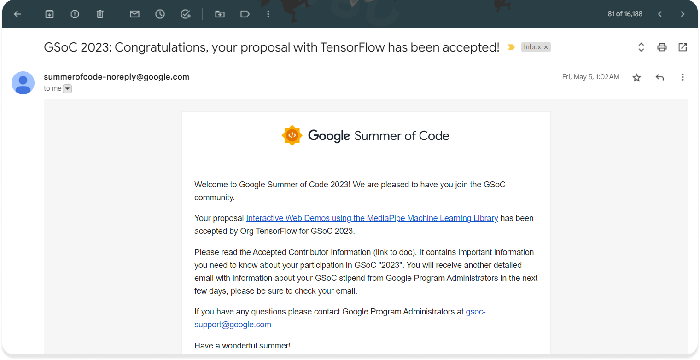

⚡ **Preface:** This blog will consist of my Journey of the *Community Bonding* period after selection in Google Summer of Code, aka GSoC 2023 under the [TensorFlow](https://www.tensorflow.org) organization with [MediaPipe](http://mediapipe.dev).  

## ~$ whoami 🤔

I am **Pratyay Banerjee**, aka [Neilblaze](https://neilblaze.live). I'm majoring in Electronics & Communication Engineering. My interests lie in the intersection of Machine Learning (Computer Vision) and Web development. I'm also a technical writer and a part-time designer. Besides, you can define me as a [*Hackathon*](https://devpost.com/neilblaze) *aficionado*, striving to build [_SOTA_](https://en.wikipedia.org/wiki/State_of_the_art) solutions for challenging problems via intersecting Web & Machine Learning to create amazing stuff that brings positive change in human lives. 

This year I have been selected as a student participant in Google Summer of Code 2023 under the organization TensorFlow & will be spending the next 10 weeks developing <mark>**_Interactive Web Demos using the MediaPipe Machine Learning Library_**</mark>. ☀️

💡 More details about the project can be found here: [**Interactive Web Demos using the MediaPipe Machine Learning Library**](https://summerofcode.withgoogle.com/programs/2023/projects/pd9KgnNP). 

You can find my _acceptance letter_ [here](https://drive.google.com/file/d/1ySFE3KgDctoGMYTB2E7dZ-0FrADB3Y3o/view?usp=sharing) ✨

## About my Organization 🏢

TensorFlow is an open-source machine learning framework developed by **Google** that has gained widespread adoption and is used by researchers, developers, and practitioners around the world. MediaPipe, on the other hand, is an open-source framework built on TensorFlow that enables the development of cross-platform pipelines for various media processing applications.

Being a part of the **TensorFlow** organization <mark>*allows me to work alongside a vibrant and diverse community of developers, researchers, and enthusiasts who are passionate about advancing the field of machine learning and artificial intelligence*</mark>. The organization has a *strong commitment to open-source collaboration* and *fosters an environment of innovation* and *knowledge sharing*. MediaPipe, within the TensorFlow ecosystem, focuses specifically on media processing tasks such as video analysis, gesture recognition, and augmented reality. It provides a comprehensive set of tools and libraries that make it easier to build real-time applications for a wide range of platforms, including mobile devices, desktops, and the web.

## My Community Bonding Period Experience 🚴🏻

I've been active with the TensorFlow community since 2021 & have been actively contributing to [TFjs](https://github.com/tensorflow/tfjs), & [MediaPipe](https://github.com/google/mediapipe) & [MediaPipe Samples](https://github.com/googlesamples/mediapipe). I have established a strong presence and developed familiarity with my mentor ([Jennifer](https://github.com/jenperson)), & a few of my other Gurus including [Jason](https://github.com/jasonmayes) & [Sayak](https://github.com/sayakpaul). Not to mention, [Paul](https://github.com/PaulTR) played a very important role in guiding me throughout this period as my mentor is currently on leave because of Google I/O 2023 and other obligations.

As I write this blog during the ongoing Community Bonding period, I am utilizing this time to deepen my understanding of the community before the start of the Coding period. With ample time remaining, I am eager to further immerse myself in the community and forge valuable connections.

🦄 By participating in the **Google Summer of Code** program under the **TensorFlow** organization and working with **MediaPipe**, I have the opportunity to leverage my passion for machine learning and computer vision to make a meaningful impact. *I am eager to collaborate with the community*, *learn from experienced mentors*, and *contribute to the advancement of MediaPipe* and its applications. Together, we can push the boundaries of what is possible and create innovative solutions that benefit developers and users alike.

## A few things I executed during the Community Bonding Period 📝

- Set up my development environment.
- Went through the MediaPipe API docs & explored new MediaPipe Samples.
- Revised proposal and set up development milestones.
- Started creating an MVP for the discussed solution.
- Finished essential tasks for GSoC onboarding.
- Introduced myself to the community & met other GSoC participants.
- Continued Learning.

# Conclusion 🚀

**That's it for now! Can't wait for the coding period to make my hands dirty! I hope you learned something valuable. Stay tuned for more such blogs** 😄