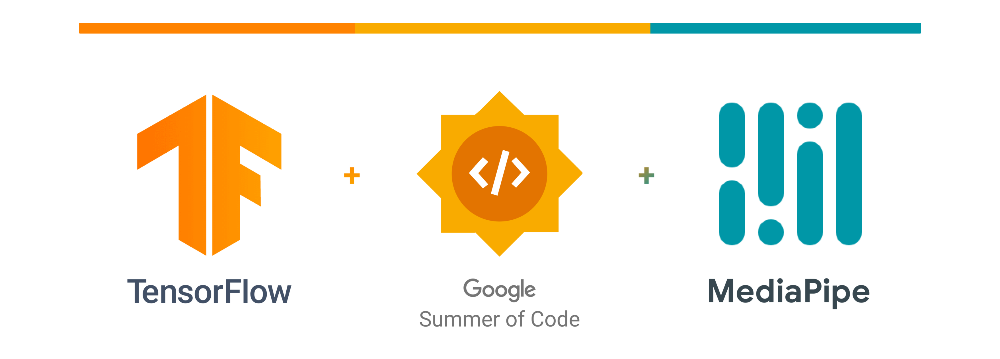

  

## 💡 **DETAILS**:

* **Year**: 2023

* **Organisation**: [<u style="background-image: linear-gradient(135deg, #FFA800, #FF6F00); -webkit-background-clip: text; -webkit-text-fill-color: transparent; font-family: Lato, Arial;">**TensorFlow**</u>](https://www.tensorflow.org) 

* **Project Title**: [Interactive Web Demos using the MediaPipe Machine Learning Library](https://summerofcode.withgoogle.com/programs/2023/projects/pd9KgnNP)

  

## 🤔 **PROJECT DESCRIPTION**:

In this proposal, I suggest developing an *interactive web app* using the **Mediapipe Hands** *JS Solution API* and simple human gestures to provide perfect contactless interactions with interfaces.

> **Background**: The *COVID-19 pandemic*  has increased awareness of hygiene risks associated with touchscreens, with reports indicating that **80%** of people find them *unhygienic*. **Touchless** *gesture-based* intuitive systems can reduce transmission in public settings and workplaces, and offer a seamless and convenient experience. Touchless technology is expected to remain popular in various industries, such as retail, healthcare, and hospitality. 

 The app will showcase an augmented *transaction panel* previewed on the screen, enabling users to perform essential CRUD operations of items through custom simple-to-use gestures, *without physical touch*. Both custom defined & pre-trained gestures from Mediapipe’s tasks-vision API will be utilized to classify gestures and trigger events on the interface. The project targets most platforms, primarily *big screens*, and may run on selective mobile devices with a camera module for input feed. *All data taken via input video feed is deleted after returning inference and is computed directly on the client side, making it GDPR compliant.* Once completed, the Web App will be uploaded to Codepen and/or deployed on Vercel.

* **Keywords / Topics**: <u style="background-image: linear-gradient(135deg, #4285F4, #4285F4); -webkit-background-clip: text; -webkit-text-fill-color: transparent; font-family: Lato, Arial;">G</u><u style="background-image: linear-gradient(135deg, #EA4335, #EA4335); -webkit-background-clip: text; -webkit-text-fill-color: transparent; font-family: Lato, Arial;">o</u><u style="background-image: linear-gradient(135deg, #FBBC05, #FBBC05); -webkit-background-clip: text; -webkit-text-fill-color: transparent; font-family: Lato, Arial;">o</u><u style="background-image: linear-gradient(135deg, #4285F4, #4285F4); -webkit-background-clip: text; -webkit-text-fill-color: transparent; font-family: Lato, Arial;">g</u><u style="background-image: linear-gradient(135deg, #34A853, #34A853); -webkit-background-clip: text; -webkit-text-fill-color: transparent; font-family: Lato, Arial;">l</u><u style="background-image: linear-gradient(135deg, #EA4335, #EA4335); -webkit-background-clip: text; -webkit-text-fill-color: transparent; font-family: Lato, Arial;">e</u>, Web, Computer Vision, Accessibility, MediaPipe, Gesture Detection, Interactability

* **Mentor**: [**Jen Person**](https://www.linkedin.com/in/jennifer-person) ([@jenperson](https://github.com/jenperson))

 

> Special Thanks to [**Paul Ruiz**](https://www.linkedin.com/in/paultruiz) ([@PaulTR](https://github.com/PaulTR)) for providing immense support and guidance throughout the program, & [**Jason Mayes**](https://www.linkedin.com/in/creativetech) ([@jasonmayes](https://github.com/jasonmayes)) for his valuable feedback on the proposal.

---

 

## 🦄 **Project Name** → **<u style="background-image: linear-gradient(135deg, #28d3fa, #2f10c7); -webkit-background-clip: text; -webkit-text-fill-color: transparent; font-family: Lato, Arial;">_Aeronexus_</u>**

> Aero" is related to air (devoid of touch), and "nexus" refers to a connection or a central point. The name is inspired by the project's goal of providing a touchless interface for users to interact with the web.

### 🏃 Try the live demo (wip) [here](https://aeronexus.neilblaze.live/). 

 

## **<u style="background-image: linear-gradient(135deg, #30c712, #154cb3); -webkit-background-clip: text; -webkit-text-fill-color: transparent; font-family: Lato, Arial;">Progress Tracker</u>** 📝

###  🟩 [**<u style="background-image: linear-gradient(135deg, #821aeb, #4509de); -webkit-background-clip: text; -webkit-text-fill-color: transparent;">Community Bonding Period</u>**](https://blog.neilblaze.live/gsoc'23-community-bonding-period-@tensorflow) (<u style="color: #016b4d; font-family: Lato, Arial;">5th May — 28th May</u>):

- Interacted with [Paul](https://github.com/PaulTR) & discussed project details, and set goals 💬
- Set up my development environment 🖥️
- Explored [<u style="background-image: linear-gradient(135deg, #0097A7, #26b5a7); -webkit-background-clip: text; -webkit-text-fill-color: transparent; font-family: Lato, Arial;">MediaPipe</u> API docs](https://developers.google.com/mediapipe/api/solutions/js/tasks-vision) & <u style="background-image: linear-gradient(135deg, #0097A7, #26b5a7); -webkit-background-clip: text; -webkit-text-fill-color: transparent; font-family: Lato, Arial;">MediaPipe</u> (Vision) [Samples](https://developers.google.com/mediapipe/solutions/examples).
- Revised proposal and set up development milestones ✍
- Started creating an <em style="color: #096bba; font-family: Lato, Arial;">MVP</em> for the discussed solution 👨‍💻
- Finished essential tasks for GSoC onboarding ☑️
- Introduced myself to the community & met other GSoC participants 👥
- Continued Learning 📚

 

###  🟩 [**<u style="background-image: linear-gradient(135deg, #821aeb, #4509de); -webkit-background-clip: text; -webkit-text-fill-color: transparent;">Week</u> <u style="background-image: linear-gradient(135deg, #821aeb, #4509de); -webkit-background-clip: text; -webkit-text-fill-color: transparent; font-family: Lato, Arial;">1 - 3</u>**]((https://blog.neilblaze.live/a-holistic-preview-of-mediapipe-for-gsoc'23-@tensorflow)) (<u style="color: #016b4d; font-family: Lato, Arial;">29th May — 21st June</u>):

- Studied the [MediaPipe HandLandmarker task](https://github.com/googlesamples/mediapipe/tree/main/examples/hand_landmarker/js) API for Web. Follow [CodePen](https://codepen.io/mediapipe-preview/pen/gOKBGPN) example for reference 📚
- Tested the it locally by wrapping it inside a [<u style="background-image: linear-gradient(135deg, #25aee8, #11aced); -webkit-background-clip: text; -webkit-text-fill-color: transparent; font-family: Lato, Arial;">React</u> App](https://react.dev) ⚛️
- Studied the [API docs](https://developers.google.com/mediapipe/solutions/vision/hand_landmarker/web_js) of <u style="background-image: linear-gradient(135deg, #0097A7, #26b5a7); -webkit-background-clip: text; -webkit-text-fill-color: transparent; font-family: Lato, Arial;">MediaPipe</u> & [Gesture Recognizer](https://developers.google.com/mediapipe/solutions/vision/gesture_recognizer/web_js) API for Web 📚
- Started writing code for the web interface and integrate MediaPipe's [hand landmark](https://developers.google.com/mediapipe/solutions/vision/hand_landmarker) model API 👨‍💻
- Cleared up the code and made notes to track progress ✍🏻

 

### 🟩 [**<u style="background-image: linear-gradient(135deg, #821aeb, #4509de); -webkit-background-clip: text; -webkit-text-fill-color: transparent;">Week</u> <u style="background-image: linear-gradient(135deg, #821aeb, #4509de); -webkit-background-clip: text; -webkit-text-fill-color: transparent; font-family: Lato, Arial;">4 - 5</u>**](https://blog.neilblaze.live/tracking-progress-for-interactive-web-demo-with-mediapipe-ml-library-under-gsoc'23-@tensorflow) (<u style="color: #016b4d; font-family: Lato, Arial;">22nd June — 6th July</u>):

- I am diligently keeping track of my work and progress ✅

- I'm pushing continuous changes to my local git tree, which allows easy tracking of changes. I'm also ensuring that new commits are pushed at regular intervals to a public [<u style="background-image: linear-gradient(135deg, #670896, #4b3c52); -webkit-background-clip: text; -webkit-text-fill-color: transparent; font-family: Lato, Arial;">**GitHub**</u>](https://github.com/Neilblaze/GSOC-23) repository & is deployed to reflect continuous improvements ☑️

- I'm running ahead of schedule, as I successfully crafted an *MVP* of the project using React.js & MediaPipe's HandLandmarker API. The working demo can be viewed → [<u><mark style="color: #f20c70; font-family: 'Trebuchet MS', sans-serif;">🔗 **here**</mark></u>](https://drive.google.com/file/d/153wPRz1Hn8N1B96VbeF7EK5ia3Vk-yw9/view) 😎

- Designed new Figma prototypes to refactor the current UI of the project for enhancement 🎨

### <u style="background-image: linear-gradient(135deg, #0097A7, #11aced); -webkit-background-clip: text; -webkit-text-fill-color: transparent; font-family: Lato, Arial;">Prototype Slides</u>  🖼️

- I'm also planning to migrate the current project to [<u style="background-image: linear-gradient(135deg, #670896, #4b3c52); -webkit-background-clip: text; -webkit-text-fill-color: transparent; font-family: Lato, Arial;">**NEXT.js**</u>](https://nextjs.org) in the coming weeks. If time permits, I'll consider adding snapshot-testing to the project.

- [Latest] Wrote [this](https://blog.neilblaze.live/tracking-progress-for-interactive-web-demo-with-mediapipe-ml-library-under-gsoc'23-@tensorflow) blog on how to use MediaPipe Model Maker to train custom models for hand tracking. 📝

- Cleared up the code and made notes to track progress ✍🏻

---