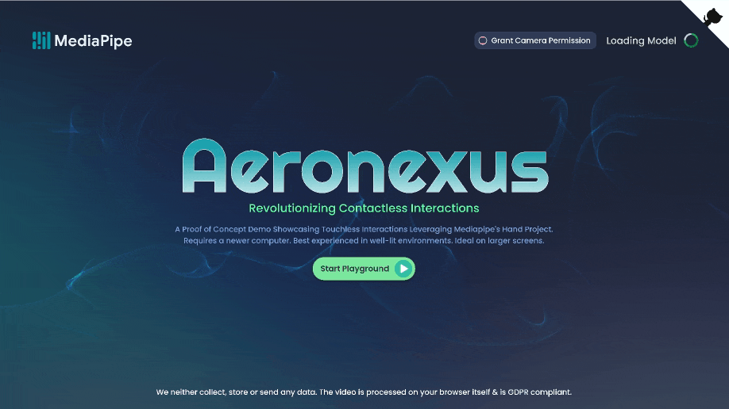
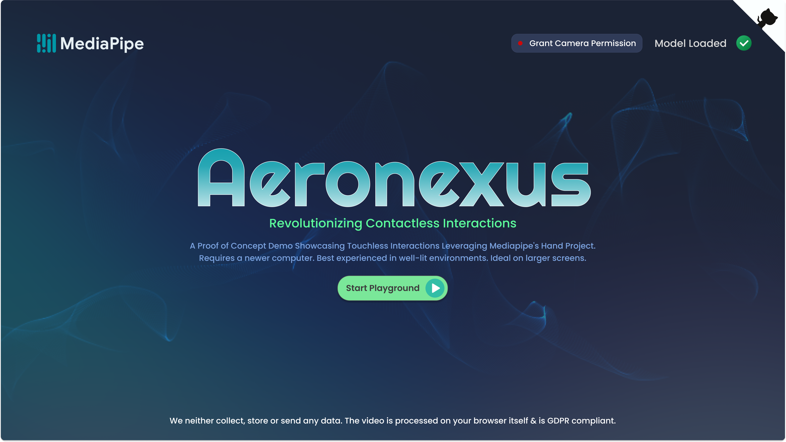
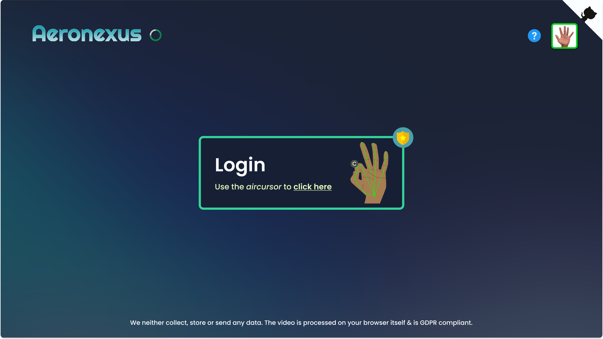
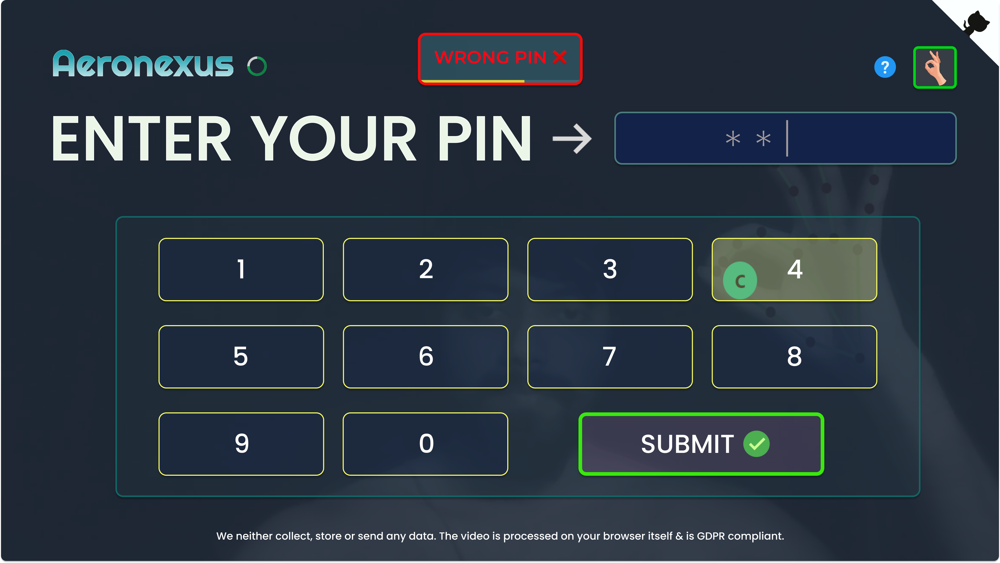
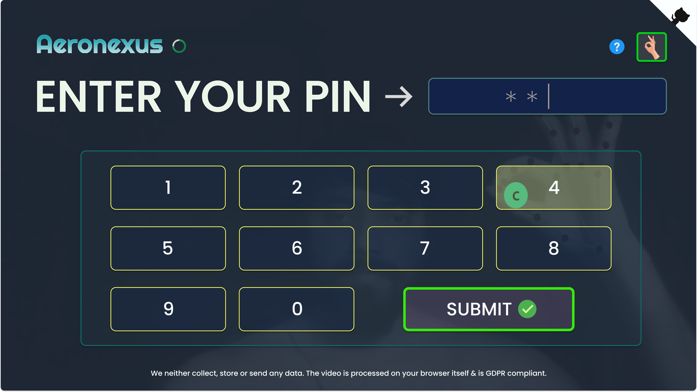
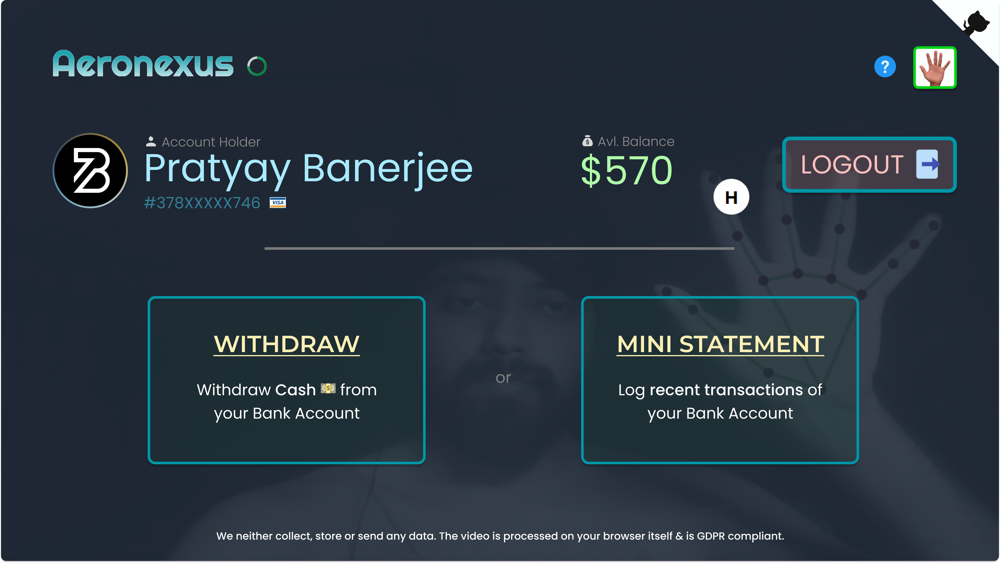
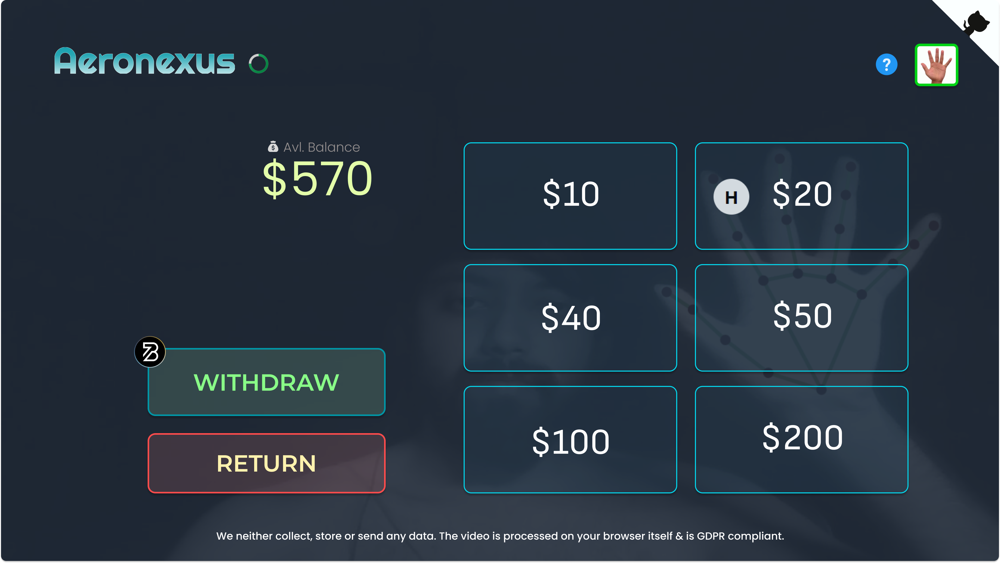
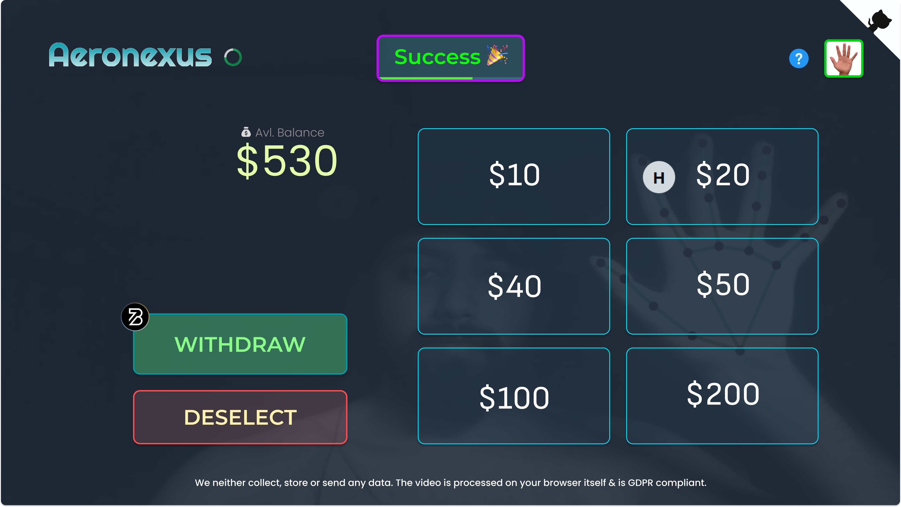
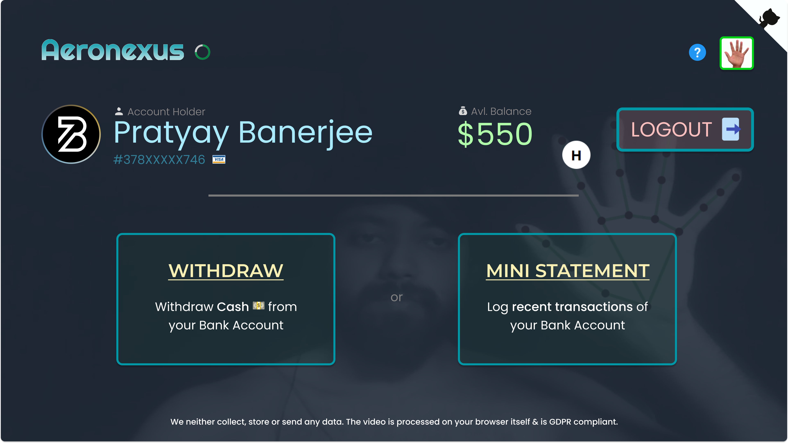
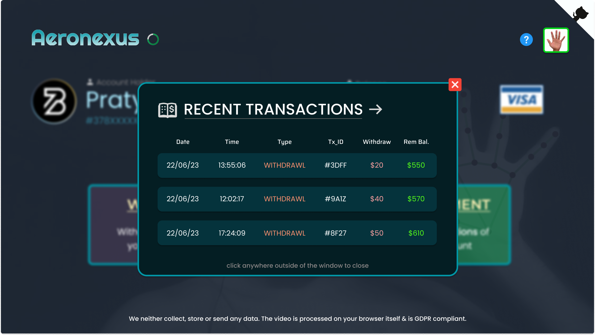

  

## 💡 **DETAILS**:

* **Year**: 2023

* **Organisation**: [TensorFlow](https://www.tensorflow.org) 

* **Project Title**: [Interactive Web Demos using the MediaPipe Machine Learning Library](https://summerofcode.withgoogle.com/programs/2023/projects/pd9KgnNP)

  

## 🤔 **PROJECT DESCRIPTION**:

In this proposal, I suggest developing an *interactive web app* using the **Mediapipe Hands** *JS Solution API* and simple human gestures to provide perfect contactless interactions with interfaces.

> **Background**: The *COVID-19 pandemic*  has increased awareness of hygiene risks associated with touchscreens, with reports indicating that **80%** of people find them *unhygienic*. **Touchless** *gesture-based* intuitive systems can reduce transmission in public settings and workplaces, and offer a seamless and convenient experience. Touchless technology is expected to remain popular in various industries, such as retail, healthcare, and hospitality. 

 The app will showcase an augmented *transaction panel* previewed on the screen, enabling users to perform essential CRUD operations of items through custom simple-to-use gestures, *without physical touch*. Both custom defined & pre-trained gestures from Mediapipe’s tasks-vision API will be utilized to classify gestures and trigger events on the interface. The project targets most platforms, primarily *big screens*, and may run on selective mobile devices with a camera module for input feed. *All data taken via input video feed is deleted after returning inference and is computed directly on the client side, making it GDPR compliant.* Once completed, the Web App will be uploaded to Codepen and/or deployed on Vercel.

* **Keywords / Topics**: Web, Computer Vision, Accessibility, MediaPipe, Gesture Detection, Interactability

* **Mentor**: [**Jen Person**](https://www.linkedin.com/in/jennifer-person) ([@jenperson](https://github.com/jenperson))

 

> Special Thanks to [**Paul Ruiz**](https://www.linkedin.com/in/paultruiz) ([@PaulTR](https://github.com/PaulTR)) for providing immense support and guidance throughout the program, & [**Jason Mayes**](https://www.linkedin.com/in/creativetech) ([@jasonmayes](https://github.com/jasonmayes)) for his valuable feedback on the proposal.

---

 

## 🦄 **Project Name** → **_Aeronexus_**

> Aero" is related to air (devoid of touch), and "nexus" refers to a connection or a central point. The name is inspired by the project's goal of providing a touchless interface for users to interact with the web.

 

## 📝 **PROGRESS TRACKER**:

###  𒀖 [**Community Bonding Period**](https://blog.neilblaze.live/gsoc'23-community-bonding-period-@tensorflow) (5th May — 28th May):

- Interacted with [Paul](https://github.com/PaulTR) & discussed project details, and setting goals.
- Set up my development environment.
- Went through the [MediaPipe API docs](https://developers.google.com/mediapipe/api/solutions/js/tasks-vision) & explored new MediaPipe [Samples](https://developers.google.com/mediapipe/solutions/examples) (Vision).
- Revised proposal and set up development milestones.
- Started creating an MVP for the discussed solution.
- Finished essential tasks for GSoC onboarding.
- Introduced myself to the community & met other GSoC participants.
- Continued Learning.

 

###  𒀖 **Week 1-3** (29th May — 21st June):

- Studied the [MediaPipe HandLandmarker task](https://github.com/googlesamples/mediapipe/tree/main/examples/hand_landmarker/js) API for Web. Follow [CodePen](https://codepen.io/mediapipe-preview/pen/gOKBGPN) example for reference.
- Tested the it locally by wrapping it inside a React App.
- Studied the [API docs](https://developers.google.com/mediapipe/solutions/vision/hand_landmarker/web_js) of MediaPipe & [Gesture Recognizer](https://developers.google.com/mediapipe/solutions/vision/gesture_recognizer/web_js) API for Web.
- Started writing code for the web interface and integrate MediaPipe's [hand landmark](https://developers.google.com/mediapipe/solutions/vision/hand_landmarker) model API.
- Cleared up the code and made notes to track progress.

 

### 𒃼 **Week 4** [WIP] (22nd June — 29th June):

- I am diligently keeping track of my work and progress.

- I'm pushing continuous changes to my local git tree, which allows easy tracking of changes. I'll ensure that new commits are pushed at regular intervals to a public GitHub repository & is deployed to reflect continuous improvements.

- I'm running ahead of schedule, as I successfully crafted an MVP of the project using React.js & MediaPipe's HandLandmarker API. The working demo can be explored [here](https://drive.google.com/file/d/153wPRz1Hn8N1B96VbeF7EK5ia3Vk-yw9/view).

- Designed new Figma prototypes to refactor the current  UI of the project for enhancement. 

## 🖼️ **Prototypes**:

<pre>
 
 
 
 
 
 
 
 
 
 
 
 
</pre>

- I'm also planning to migrate the current project to Next.js in the coming weeks. If time permits, I'll consider adding Snapshot Testing to the project.

- Started writing tutorial blogs for this project ⏳

---