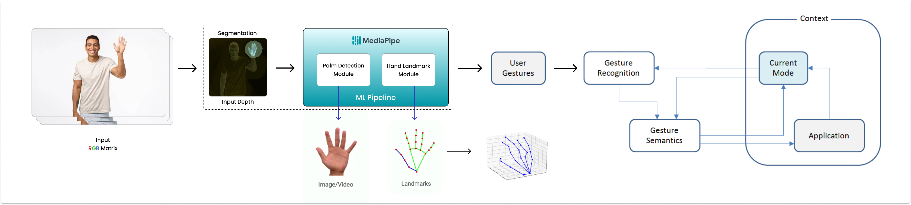

## **<u style="background-image: linear-gradient(135deg, #FFA800, #FF6F00); -webkit-background-clip: text; -webkit-text-fill-color: transparent; font-family: Lato, Arial;">Preface</u>** ⚡
 
As a participant in this year's **Google Summer of Code** ☀️ program, I will develop <mark><u style="color: #05992a">**Interactive Web Demos using the MediaPipe Machine Learning Library**</u></mark>. I aim to share my experience of leveraging <u style="background-image: linear-gradient(135deg, #0097A7, #26b5a7); -webkit-background-clip: text; -webkit-text-fill-color: transparent; font-family: Lato, Arial;">MediaPipe</u>'s Solutions APIs, which enable <em style="font-family: 'Trebuchet MS', sans-serif;">intuitive contactless interactions with interfaces</em> through simple human gestures. Stay tuned for a series of *blog* posts where I will share my experiments and valuable learnings.


In this blog post, you'll explore [<u style="background-image: linear-gradient(135deg, #0097A7, #26b5a7); -webkit-background-clip: text; -webkit-text-fill-color: transparent; font-family: Lato, Arial;">**MediaPipe**</u>](http://mediapipe.dev)'s **HandLandmarker API** from the [<mark><u style="color: #034354">**Task-Vision**</u></mark>](https://github.com/google/mediapipe/tree/master/mediapipe/tasks/web/vision) library for the *Web*, I'll show you how to utilize **<mark style="color: #057ba6">MediaPipe's Model Maker</mark>** to create a custom Gesture Recognizer. Besides, I'll also provide insights on building a web app that responds to simple <em style="color: #096bba; font-family: Lato, Arial;">Hand Gestures</em>. Additionally, I'll share a Progress Tracker to keep you updated on the project's status. Stay tuned as this post is part of my *Google Summer of Code 2023* journey with <u style="background-image: linear-gradient(135deg, #FFA800, #FF6F00); -webkit-background-clip: text; -webkit-text-fill-color: transparent; font-family: Lato, Arial;">**TensorFlow**</u>.

<br/>

💡 <u>**For more information about the project, please visit here**</u>: [**Interactive Web Demos using the MediaPipe Machine Learning Library**](https://summerofcode.withgoogle.com/programs/2023/projects/pd9KgnNP). 

🚴🏻 <u>**Explore my Community Bonding experience here**</u>: [**Community Bonding Period Experience**](https://blog.neilblaze.live/gsoc'23-community-bonding-period-@tensorflow/).

<!--  -->


<center style="color: #8fa387;"> ⬆️ Credits: Google Images </center><br/>

## **<u style="background-image: linear-gradient(135deg, #048f19, #7acc29); -webkit-background-clip: text; -webkit-text-fill-color: transparent; font-family: Lato, Arial;">Motivation</u>** 🤩


The COVID-19 pandemic has brought a drastic change to our lives, as people are now more aware of the risks associated with touch and hygiene. <u style="color: #db8c02; font-family: 'Trebuchet MS', sans-serif;">Reports indicate that</u> <u style="color: #f50c46;">**80%**</u> <u style="color: #db8c02; font-family: 'Trebuchet MS', sans-serif;">of people find public touchscreens unhygienic</u>. Despite the end of the pandemic, **touchless systems** are expected to remain popular due to their *intuitive and futuristic appeal*.

💡 **Case Study**: [According to SPER Market Research, the Gesture Recognition and Touchless Sensing Market is estimated to reach <u style="background-image: linear-gradient(135deg, #06bf22, #039e4c); -webkit-background-clip: text; -webkit-text-fill-color: transparent; font-family: Lato, Arial;">**USD 138.58 Billion**</u> **by 2032** with a CAGR of 20.76%.](https://www.linkedin.com/pulse/gesture-recognition-touchless-sensing-market-size-2023-lucia-jones/)


<center style="color: #8fa387;"> ⬆️ Credits: Ultraleap Touch Free </center><br/><br/>

**Touchless gesture-based intuitive systems** can reduce transmission in public settings and workplaces, and offer a seamless and convenient experience. <u style="background-image: linear-gradient(135deg, #0ba13f, #077a3e); -webkit-background-clip: text; -webkit-text-fill-color: transparent; font-family: Lato, Arial;">Touchless technology will likely become more widespread in various industries</u>, *such as <mark>ATMs</mark>, <mark>airports</mark>, <mark>hotels</mark>, <mark>retail</mark>, <mark>healthcare and hospitality</mark>* as well as in *<mark>gaming industry</mark>*, as organizations recognize the value of meeting customer expectations and improving efficiency by offering a cutting-edge experience. The plan is to develop an interactive web app which works with simple human gestures to facilitate perfect contactless interactions with interfaces. 

The proposed application will incorporate *four* key <u style="background-image: linear-gradient(135deg, #0097A7, #26b5a7); -webkit-background-clip: text; -webkit-text-fill-color: transparent;">MediaPipe</u> components, including:

- [@mediapipe/camera_utils](https://www.npmjs.com/package/@mediapipe/camera_utils) 	    — Utilities to operate the camera.
- [@mediapipe/control_utils](https://www.npmjs.com/package/@mediapipe/control_utils) 	    — Utilities to show sliders and FPS widgets.
- [@mediapipe/drawing_utils](https://www.npmjs.com/package/@mediapipe/drawing_utils)	    — Utilities to draw landmarks and connectors.
- [@mediapipe/hands](https://www.npmjs.com/package/@mediapipe/hands)		        — Utilities to detect & track hands + fingers.

Now, things have become much easier. We will utilize MediaPipe's newly released **Task Vision** API, specifically the <mark><u style="color: #e405fc">_`HandGestureRecognizer`_</u></mark> Task for the web, which is built upon <u style="background-image: linear-gradient(135deg, #0097A7, #26b5a7); -webkit-background-clip: text; -webkit-text-fill-color: transparent; font-family: Lato, Arial;">**MediaPipe**</u>'s **Solutions** API. This will greatly simplify the process.

The ultimate goal is to provide a web app that showcases an *<mark><u style="color: #0f81fa">augmented transaction panel previewed on screen, enabling users to interact accurately through intuitive gestures detected from an input video feed</u></mark>*. Users can perform essential Create, Read, Update, and Delete (CRUD) operations of items directly through the interactive floating panel (on screen) via custom simple-to-use gestures, enabling them to experience the checkout process without the need for physical touch.

While it is possible to utilize the pre-trained gestures available in Mediapipe's [tasks-vision](https://developers.google.com/mediapipe/solutions/vision/gesture_recognizer/web_js) API, specifically the “[mp.tasks.vision.GestureRecognizer](https://developers.google.com/mediapipe/api/solutions/python/mp/tasks/vision/GestureRecognizer)”, we will take a different approach. We will leverage MediaPipe's [_**Model Maker**_](https://developers.google.com/mediapipe/solutions/model_maker) to create our own Gesture Recognizer task. This custom task will enable us to <mark style="color: #4d168c">*classify* gestures and *trigger* events accordingly</mark>. Once the task is developed, we will deploy it on a free serverless PaaS like [Vercel](https://vercel.com).




### **<u style="color: #a410c9; font-family: Lato, Arial;">Background Study & Market Research</u>** 🔬

The driving force behind conducting background research and market analysis for this project is to understand the feasibility and practicality of the proposed idea in the current market. <u style="background-image: linear-gradient(135deg, #3c6fd6, #864dd6); -webkit-background-clip: text; -webkit-text-fill-color: transparent; font-family: Lato, Arial;">**Through extensive research spanning several weeks, the project's unique selling proposition is its ease of implementation**</u>, <u style="background-image: linear-gradient(135deg, #0fbf15, #0ac2b9); -webkit-background-clip: text; -webkit-text-fill-color: transparent; font-family: Lato, Arial;">**_low maintenance_**</u>, <u style="background-image: linear-gradient(135deg, #0fbf15, #0ac2b9); -webkit-background-clip: text; -webkit-text-fill-color: transparent; font-family: Lato, Arial;">**_high accuracy_**</u>, and <u style="background-image: linear-gradient(135deg, #0fbf15, #0ac2b9); -webkit-background-clip: text; -webkit-text-fill-color: transparent; font-family: Lato, Arial;">**_efficiency_**</u>. Although there are existing commercial solutions such as [**Ultraleap**](https://www.ultraleap.com/enterprise/touchless-experiences/touchfree-solution) & [**Ideum**](https://ideum.com/news/gesture-interaction-public-spaces-part1), the project's ultimate objective is to make this technology accessible to the masses, as it will be open-sourced. The open-source nature of the project empowers developers to customize and integrate their own features, enhancing its flexibility and utility. Not to mention, <em>all of the computation is performed on the client side</em> itself making it way more secure than anything else! With that said, performing machine learning on-device can help to improve <mark style="color: #0f81fa; font-family: 'Trebuchet MS', sans-serif;">*Latency*</mark>, <mark style="color: #0f81fa; font-family: 'Trebuchet MS', sans-serif;">*Power consumption*</mark>, <mark style="color: #0f81fa; font-family: 'Trebuchet MS', sans-serif;">*Connectivity*</mark>, and most importantly <mark style="color: #0f81fa; font-family: 'Trebuchet MS', sans-serif;">*Privacy*</mark>.


## **<u style="background-image: linear-gradient(135deg, #b31af0, #611af0); -webkit-background-clip: text; -webkit-text-fill-color: transparent; font-family: Lato, Arial;">Pre-GSOC Work</u>**:

I’m been consistently exploring the [API docs](https://developers.google.com/mediapipe/api/solutions/js/tasks-vision) & working on this project for a while, & have *successfully implemented the <em style="color: #2a6ef5; font-family: 'Trebuchet MS', sans-serif;">MediaPipe HandTrack</em> in this example app*. 


You can access the <u style="background-image: linear-gradient(135deg, #670896, #4b3c52); -webkit-background-clip: text; -webkit-text-fill-color: transparent; font-family: Lato, Arial;">**GitHub**</u> repository [🔗<u>here</u>](https://github.com/Neilblaze/MediaPipe-HandTrack) & the live demo [🔗<u>here</u>](https://sandbox-v2.neilblaze.live).


## <u style="background-image: linear-gradient(135deg, #4285F4, #0d50bf); -webkit-background-clip: text; -webkit-text-fill-color: transparent; font-family: Lato, Arial;">Brief intro to</u> **<u style="background-image: linear-gradient(135deg, #FFA800, #FF6F00); -webkit-background-clip: text; -webkit-text-fill-color: transparent; font-family: Lato, Arial;">TensorFlow</u>** <u style="background-image: linear-gradient(135deg, #4285F4, #0d50bf); -webkit-background-clip: text; -webkit-text-fill-color: transparent; font-family: Lato, Arial;">&</u> <u style="background-image: linear-gradient(135deg, #0097A7, #26b5a7); -webkit-background-clip: text; -webkit-text-fill-color: transparent; font-family: Lato, Arial;">MediaPipe</u> 🤖

In general, <u style="background-image: linear-gradient(135deg, #FFA800, #FF6F00); -webkit-background-clip: text; -webkit-text-fill-color: transparent; font-family: Lato, Arial;">TensorFlow</u> is an open-source machine learning framework developed by <u style="background-image: linear-gradient(135deg, #4285F4, #4285F4); -webkit-background-clip: text; -webkit-text-fill-color: transparent; font-family: Lato, Arial;">G</u><u style="background-image: linear-gradient(135deg, #EA4335, #EA4335); -webkit-background-clip: text; -webkit-text-fill-color: transparent; font-family: Lato, Arial;">o</u><u style="background-image: linear-gradient(135deg, #FBBC05, #FBBC05); -webkit-background-clip: text; -webkit-text-fill-color: transparent; font-family: Lato, Arial;">o</u><u style="background-image: linear-gradient(135deg, #4285F4, #4285F4); -webkit-background-clip: text; -webkit-text-fill-color: transparent; font-family: Lato, Arial;">g</u><u style="background-image: linear-gradient(135deg, #34A853, #34A853); -webkit-background-clip: text; -webkit-text-fill-color: transparent; font-family: Lato, Arial;">l</u><u style="background-image: linear-gradient(135deg, #EA4335, #EA4335); -webkit-background-clip: text; -webkit-text-fill-color: transparent; font-family: Lato, Arial;">e</u> that has gained widespread adoption and is used by researchers, developers, and practitioners around the world. <u style="background-image: linear-gradient(135deg, #0097A7, #26b5a7); -webkit-background-clip: text; -webkit-text-fill-color: transparent; font-family: Lato, Arial;">MediaPipe</u>, *on the other hand, is an open-source framework built on* TensorFlow *that enables the development of cross-platform pipelines for various media processing applications.*


### <u style="background-image: linear-gradient(135deg, #240561, #2d0480); -webkit-background-clip: text; -webkit-text-fill-color: transparent; font-family: Lato, Arial;">So why</u> <u style="background-image: linear-gradient(135deg, #0097A7, #26b5a7); -webkit-background-clip: text; -webkit-text-fill-color: transparent; font-family: Lato, Arial;">MediaPipe</u><u style="background-image: linear-gradient(135deg, #0e0226, #030226); -webkit-background-clip: text; -webkit-text-fill-color: transparent; font-family: Lato, Arial;">?</u> 🤔

**_MediaPipe_**, within the TensorFlow ecosystem, focuses specifically on media processing tasks such as <em style="color: #2a6ef5; font-family: 'Trebuchet MS', sans-serif;">*video analysis*</em>, <em style="color: #2a6ef5; font-family: 'Trebuchet MS', sans-serif;">*gesture recognition*</em>, and <em style="color: #2a6ef5; font-family: 'Trebuchet MS', sans-serif;">*augmented reality*</em>. It provides a <mark style="color: #057a27">**_comprehensive set of tools and libraries_**</mark> that make it easier to build _**real-time**_ applications for a wide range of platforms, including mobile devices, desktops, and the **Web**.

💡 Perceiving hand shape and motion is _crucial_ for enhancing user experience in various domains and platforms. _<u style="color: #4d168c; font-family: 'Trebuchet MS', sans-serif;">It enables **hand gesture control** and overlaying digital content on the **physical world** in **augmented reality**</u>_. However, *real-time* hand perception is a challenging computer vision task due to occlusions and lack of high contrast patterns.

🚀 <u style="background-image: linear-gradient(135deg, #4285F4, #4285F4); -webkit-background-clip: text; -webkit-text-fill-color: transparent; font-family: Lato, Arial;">G</u><u style="background-image: linear-gradient(135deg, #EA4335, #EA4335); -webkit-background-clip: text; -webkit-text-fill-color: transparent; font-family: Lato, Arial;">o</u><u style="background-image: linear-gradient(135deg, #FBBC05, #FBBC05); -webkit-background-clip: text; -webkit-text-fill-color: transparent; font-family: Lato, Arial;">o</u><u style="background-image: linear-gradient(135deg, #4285F4, #4285F4); -webkit-background-clip: text; -webkit-text-fill-color: transparent; font-family: Lato, Arial;">g</u><u style="background-image: linear-gradient(135deg, #34A853, #34A853); -webkit-background-clip: text; -webkit-text-fill-color: transparent; font-family: Lato, Arial;">l</u><u style="background-image: linear-gradient(135deg, #EA4335, #EA4335); -webkit-background-clip: text; -webkit-text-fill-color: transparent; font-family: Lato, Arial;">e</u>’s <u style="background-image: linear-gradient(135deg, #0097A7, #26b5a7); -webkit-background-clip: text; -webkit-text-fill-color: transparent; font-family: Lato, Arial;">MediaPipe</u> Hands Solution is a high-fidelity [*hand and finger tracking*](https://developers.google.com/mediapipe/solutions/vision/hand_landmarker) solution from real-time video input. It performs <em style="color: #4d168c">exceptionally well in various backgrounds with multiple objects</em>, as it employs machine learning (ML) to infer **21** 3D landmarks of a hand from just a single frame via regression, that is *direct coordinate prediction*. The model learns a <em style="color: #057a27">consistent internal hand pose representation and is robust even to partially visible hands and self-occlusions</em>. This is essential for hand & finger tracking for gesture-based interfaces or augmented reality experiences. The library is designed to be easy to use and provides a high-level API for integrating hand tracking into this application.

And above all, it’s free & open-source! 🧡

🧰 [<u style="background-image: linear-gradient(135deg, #0097A7, #26b5a7); -webkit-background-clip: text; -webkit-text-fill-color: transparent; font-family: Lato, Arial;">**MediaPipe**</u> <u style="background-image: linear-gradient(135deg, #0a8c88, #2da3d6); -webkit-background-clip: text; -webkit-text-fill-color: transparent; font-family: Lato, Arial;">**Tasks**</u>](https://developers.google.com/mediapipe/solutions/tasks) got introduced in **<u style="background-image: linear-gradient(135deg, #4285F4, #4285F4); -webkit-background-clip: text; -webkit-text-fill-color: transparent; font-family: Lato, Arial;">G</u><u style="background-image: linear-gradient(135deg, #EA4335, #EA4335); -webkit-background-clip: text; -webkit-text-fill-color: transparent; font-family: Lato, Arial;">o</u><u style="background-image: linear-gradient(135deg, #FBBC05, #FBBC05); -webkit-background-clip: text; -webkit-text-fill-color: transparent; font-family: Lato, Arial;">o</u><u style="background-image: linear-gradient(135deg, #4285F4, #4285F4); -webkit-background-clip: text; -webkit-text-fill-color: transparent; font-family: Lato, Arial;">g</u><u style="background-image: linear-gradient(135deg, #34A853, #34A853); -webkit-background-clip: text; -webkit-text-fill-color: transparent; font-family: Lato, Arial;">l</u><u style="background-image: linear-gradient(135deg, #EA4335, #EA4335); -webkit-background-clip: text; -webkit-text-fill-color: transparent; font-family: Lato, Arial;">e</u>** [**I/O** 2023](https://io.google/) & provides <em style="color: #4d168c">no-code</em> to <em style="color: #4d168c">low-code</em> solutions to common *on-device* machine learning tasks (such image classification, segmentation, & others, for different platforms including Web). To learn more, feel free to refer to I/O 2023 sessions: [<u style="color: #64b5bd; font-family: 'Trebuchet MS', sans-serif;">Easy on-device ML with MediaPipe</u>](https://io.google/2023/program/44701430-a72b-47e3-aeb9-a6f8d5faace4/), [<u style="color: #64b5bd; font-family: 'Trebuchet MS', sans-serif;">Supercharge your web app with machine learning and MediaPipe</u>](https://io.google/2023/program/dcece33d-7fc9-490c-8a6d-cc7f83fc0d1f/), and [<u style="color: #64b5bd; font-family: 'Trebuchet MS', sans-serif;">What's new in machine learning</u>](https://io.google/2023/program/4b9ae421-afec-4c6e-a3ca-dfa1164f7cff/), and check out their official documentation over [🔗**<u style="color: #DB4437">here</u>**](https://developers.google.com/mediapipe).

Not to mention, <u style="background-image: linear-gradient(135deg, #0097A7, #26b5a7); -webkit-background-clip: text; -webkit-text-fill-color: transparent; font-family: Lato, Arial;">MediaPipe</u> has simplified the development of <em style="color: #4d168c">customizable</em>, <em style="color: #4d168c">production-ready</em>, and <em style="color: #4d168c">cross-platform</em> **on-device** machine learning solutions. Here are the key features:

- Lightweight ML models with high accuracy
- Domain-specific processing for vision, text, and audio
- Efficient acceleration on both CPU and GPU
- Support for complex pipeline graphs with multiple models and states
- Cross-platform deployment on Android, iOS, web, and bare metal

Now, let's focus on the project. With <u style="background-image: linear-gradient(135deg, #0097A7, #26b5a7); -webkit-background-clip: text; -webkit-text-fill-color: transparent; font-family: Lato, Arial;">**MediaPipe**</u> <u style="background-image: linear-gradient(135deg, #057d7a, #057d7a); -webkit-background-clip: text; -webkit-text-fill-color: transparent; font-family: Lato, Arial;">**Tasks**</u> (a low-code API), you can easily deploy advanced on-device ML solutions. <em style="color: #228038">Choose a task, such as **hand gesture recognition**, that suits your needs</em>. With just a few lines of code, you can deploy your solution across multiple platforms. It's that simple!


### <u style="color: #375899; font-family: Lato, Arial;">Why use gesture recognition</u><u style="background-image: linear-gradient(135deg, #0e0226, #030226); -webkit-background-clip: text; -webkit-text-fill-color: transparent; font-family: Lato, Arial;">?</u> ✌️🤟👌

The goal of <em style="color: #2a6ef5">improving human-computer interaction</em> has been pursued since the early days of the computer revolution. Touch screens have made interactions more natural, and **gesture recognition** technology is *expected to further enhance this experience*. Gestures are natural and expressive body motions that convey information or interact with the environment. It <mark style="color: #0b5e35; font-family: 'Trebuchet MS', sans-serif;">provides an intuitive way for humans to interact with devices *without physical contact*</mark>. It can be used in a variety of applications, including Gaming 🎮, AR/VR 🥽, and holds great potential for the future.


The advantages of touchless gesture control include:

- Easy to operate & provides a new way of interaction.
- Intuitive and user-friendly controls.
- Works with most devices having a camera.
- Low power consumption & maintenance cost.

Our project introduces a novel approach using <u style="background-image: linear-gradient(135deg, #0097A7, #26b5a7); -webkit-background-clip: text; -webkit-text-fill-color: transparent; font-family: Lato, Arial;">MediaPipe</u> ML library for fast and reliable gesture recognition. It <mark style="color: #07a657; font-family: 'Trebuchet MS', sans-serif;">allows for the quick **addition** or **modification of gestures**, making the system **flexible** and **adaptable**</mark> to changes. Our software understands the hand's skeletal structure, its spatial relationship to objects, and dynamic gestures like <em style="color: #2a6ef5; font-family: 'Trebuchet MS', sans-serif;">*clicking*</em>, <em style="color: #2a6ef5; font-family: 'Trebuchet MS', sans-serif;">*grabbing*</em>, and <em style="color: #2a6ef5; font-family: 'Trebuchet MS', sans-serif;">*releasing*</em> in *real-time*. 

---


### <u style="background-image: linear-gradient(135deg, #240561, #2d0480); -webkit-background-clip: text; -webkit-text-fill-color: transparent; font-family: Lato, Arial;">What is</u> <u style="background-image: linear-gradient(135deg, #0097A7, #26b5a7); -webkit-background-clip: text; -webkit-text-fill-color: transparent; font-family: Lato, Arial;">MediaPipe Solutions</u><u style="background-image: linear-gradient(135deg, #240561, #240561); -webkit-background-clip: text; -webkit-text-fill-color: transparent; font-family: Lato, Arial;">?</u> 🧩

**MediaPipe Solutions** is a versatile framework based on <u style="background-image: linear-gradient(135deg, #0097A7, #26b5a7); -webkit-background-clip: text; -webkit-text-fill-color: transparent; font-family: Lato, Arial;">**MediaPipe**</u> for creating machine learning pipelines across platforms. It <mark style="color: #065957; font-family: 'Trebuchet MS', sans-serif;">offers *customizable building blocks* for applying AI and ML techniques</mark> to your specific requirements. With MediaPipe Solutions, you can quickly integrate and customize these solutions in your applications, supporting multiple development platforms. It is available for Web (JavaScript), Python, and Android (Java), and is part of the open-source MediaPipe project, <em style="color: #228038">**allowing further customization**</em> as needed.


#### 🔆 **<u style="background-image: linear-gradient(135deg, #2a67b8, #2a67b8); -webkit-background-clip: text; -webkit-text-fill-color: transparent; font-family: Lato, Arial;">These libraries and resources provide the core functionality for each</u>** <u style="background-image: linear-gradient(135deg, #0097A7, #26b5a7); -webkit-background-clip: text; -webkit-text-fill-color: transparent; font-family: Lato, Arial;">**MediaPipe**</u> **<u style="background-image: linear-gradient(135deg, #2a67b8, #2a67b8); -webkit-background-clip: text; -webkit-text-fill-color: transparent; font-family: Lato, Arial;">Solution</u>**:

- **MediaPipe Tasks:** Cross-platform APIs and libraries for deploying solutions. [Learn more](https://developers.google.com/mediapipe/solutions/tasks).
- **MediaPipe Models:** Pre-trained, ready-to-run models for use with each solution.


#### 🔆 **<u style="background-image: linear-gradient(135deg, #2a67b8, #2a67b8); -webkit-background-clip: text; -webkit-text-fill-color: transparent; font-family: Lato, Arial;">These tools let you customize and evaluate solutions</u>**:

- **MediaPipe Model Maker:** Customize models for solutions with your data. [Learn more](https://developers.google.com/mediapipe/solutions/model_maker).
- **MediaPipe Studio:** Visualize, evaluate, and benchmark solutions in your browser. [Learn more](https://developers.google.com/mediapipe/solutions/studio).

For our project, we will utilize <em style="color: #2a6ef5">Hand Landmark Detection</em> and <em style="color: #2a6ef5">Gesture Recognition</em>. Furthermore, we will customize the Gesture Recognition Model using <u style="background-image: linear-gradient(135deg, #0097A7, #26b5a7); -webkit-background-clip: text; -webkit-text-fill-color: transparent; font-family: Lato, Arial;">MediaPipe</u> [Model Maker](https://developers.google.com/mediapipe/solutions/model_maker) and incorporate the [task-vision package](https://developers.google.com/mediapipe/api/solutions/js/tasks-vision) from MediaPipe.

#### ○ Notable Tasks-Vision package Classes:


| Class                    |      ‍   |                             Description                          |
|--------------------------|:-------:|-----------------------------------------------------------------:|
| [**DrawingUtils**](https://developers.google.com/mediapipe/api/solutions/js/tasks-vision.drawingutils#drawingutils_class)         |    →    | Helper class to visualize the result of a MediaPipe Vision task. |
| [**FilesetResolver**](https://developers.google.com/mediapipe/api/solutions/js/tasks-vision.filesetresolver#filesetresolver_class)      |    →    | Resolves the files required for the MediaPipe Task APIs.         |
| [**GestureRecognizer**](https://developers.google.com/mediapipe/api/solutions/js/tasks-vision.gesturerecognizer#gesturerecognizer_class)    |    →    | Performs hand gesture recognition on images.                     |
| [**HandLandmarker**](https://developers.google.com/mediapipe/api/solutions/js/tasks-vision.handlandmarker#handlandmarker_class)       |    →    | Performs hand landmarks detection on images.                     |

#### ○ Notable Tasks-Vision package Interfaces:

| Interfaces                        |      ‍   |                                Description                                    |
|-----------------------------------|:-------:|------------------------------------------------------------------------------:|
| [**BoundingBox**](https://developers.google.com/mediapipe/api/solutions/js/tasks-vision.boundingbox#boundingbox_interface)                   |    →    | An integer bounding box, axis aligned.                                        |
| [**Category**](https://developers.google.com/mediapipe/api/solutions/js/tasks-vision.category#category_interface)                      |    →    | A classification category.                                                    |    
| [**Classifications**](https://developers.google.com/mediapipe/api/solutions/js/tasks-vision.classifications#classifications_interface)               |    →    | Classification results for a given classifier head.                           |
| [**Detection**](https://developers.google.com/mediapipe/api/solutions/js/tasks-vision.detection#detection_interface)                     |    →    | Represents one detection by a detection task.                                 |
| [**DetectionResult**](https://developers.google.com/mediapipe/api/solutions/js/tasks-vision.detectionresult#detectionresult_interface)               |    →    | Detection results of a model.                                                 |
| [**DrawingOptions**](https://developers.google.com/mediapipe/api/solutions/js/tasks-vision.drawingoptions#drawingoptions_interface)                |    →    | Options for customizing the drawing routines.                                 |
| [**Embedding**](https://developers.google.com/mediapipe/api/solutions/js/tasks-vision.embedding#embedding_interface)                     |    →    | List of embeddings with an optional timestamp.                                |
| [**GestureRecognizerOptions**](https://developers.google.com/mediapipe/api/solutions/js/tasks-vision.gesturerecognizeroptions#gesturerecognizeroptions_interface)      |    →    | Options to configure the MediaPipe Gesture Recognizer Task.                   |
| [**GestureRecognizerResult**](https://developers.google.com/mediapipe/api/solutions/js/tasks-vision.gesturerecognizerresult#gesturerecognizerresult_interface)       |    →    | Represents the gesture recognition results generated by `GestureRecognizer`.  |
| [**HandLandmarkerOptions**](https://developers.google.com/mediapipe/api/solutions/js/tasks-vision.handlandmarkeroptions#handlandmarkeroptions_interface)         |    →    | Options to configure the MediaPipe HandLandmarker Task.                       |
| [**HandLandmarkerResult**](https://developers.google.com/mediapipe/api/solutions/js/tasks-vision.handlandmarkerresult#handlandmarkerresult_interface)          |    →    | Represents the hand landmarks detection results generated by `HandLandmarker`.|
| [**Landmark**](https://developers.google.com/mediapipe/api/solutions/js/tasks-vision.landmark#landmark_interface)                      |    →    | Landmark represents a point in 3D space with x, y, z coordinates.             |
| [**LandmarkData**](https://developers.google.com/mediapipe/api/solutions/js/tasks-vision.landmarkdata#landmarkdata_interface)                  |    →    | Data that a user can use to specialize drawing options.                       |
| [**NormalizedLandmark**](https://developers.google.com/mediapipe/api/solutions/js/tasks-vision.normalizedlandmark#normalizedlandmark_interface)            |    →    | Represents a point in 3D space with x, y, z coordinates.                      |
| [**RegionOfInterest**](https://developers.google.com/mediapipe/api/solutions/js/tasks-vision.regionofinterest#regionofinterest_interface)              |    →    | A Region-Of-Interest (ROI) to represent a region within an image.             |

#### ○ Notable Tasks-Vision package Type Aliases:

| Type Aliases                      |      ‍   |                                Description                                    |
|-----------------------------------|:-------:|------------------------------------------------------------------------------:|
| [**Callback**](https://developers.google.com/mediapipe/api/solutions/js/tasks-vision#callback)                      |    →    | A user-defined callback to take input data and map it to a custom output value.                                        |
| [**ImageSource**](https://developers.google.com/mediapipe/api/solutions/js/tasks-vision#imagesource)                   |    →    | Valid types of image sources which we can run our GraphRunner over.                                         |
| [**PoseLandmarkerCallback**](https://developers.google.com/mediapipe/api/solutions/js/tasks-vision#poselandmarkercallback)        |    →    | A callback that receives the result from the pose detector.                                     |                                        


🧵 <u style="background-image: linear-gradient(135deg, #0097A7, #26b5a7); -webkit-background-clip: text; -webkit-text-fill-color: transparent; font-family: Lato, Arial;">**MediaPipe**</u>'s **Tasks Vision API** lets you apply machine-learning (ML) solutions to your apps. It *provides a <em style="color: #259c08; font-family: 'Trebuchet MS', sans-serif;">framework</em>* that lets you *configure & customize prebuilt processing pipelines* and *update default models* with **Model Maker**. Once done, test your customized solution using the MediaPipe Studio <em style="color: #7e1adb; font-family: 'Trebuchet MS', sans-serif;">**Gesture Recognition**</em> demo available [🔗<u>here</u>](https://mediapipe-studio.webapps.google.com/demo/gesture_recognizer).

The demo recognizes hand gestures based on *predefined* classes, with the default model recognizing seven classes (👍, 👎, ✌️, ☝️, ✊, 👋, 🤟) in one or two hands. The default model has undergone <u style="background-image: linear-gradient(135deg, #4285F4, #4285F4); -webkit-background-clip: text; -webkit-text-fill-color: transparent; font-family: Lato, Arial;">G</u><u style="background-image: linear-gradient(135deg, #EA4335, #EA4335); -webkit-background-clip: text; -webkit-text-fill-color: transparent; font-family: Lato, Arial;">o</u><u style="background-image: linear-gradient(135deg, #FBBC05, #FBBC05); -webkit-background-clip: text; -webkit-text-fill-color: transparent; font-family: Lato, Arial;">o</u><u style="background-image: linear-gradient(135deg, #4285F4, #4285F4); -webkit-background-clip: text; -webkit-text-fill-color: transparent; font-family: Lato, Arial;">g</u><u style="background-image: linear-gradient(135deg, #34A853, #34A853); -webkit-background-clip: text; -webkit-text-fill-color: transparent; font-family: Lato, Arial;">l</u><u style="background-image: linear-gradient(135deg, #EA4335, #EA4335); -webkit-background-clip: text; -webkit-text-fill-color: transparent; font-family: Lato, Arial;">e</u>'s rigorous ML Fairness standards and is production ready. Refer to the [model card](https://storage.googleapis.com/mediapipe-assets/gesture_recognizer/model_card_hand_gesture_classification_with_faireness_2022.pdf) for more details. Check the [documentation](https://developers.google.com/mediapipe/solutions/vision/gesture_recognizer#models) for label information and performance.

The Gesture Recognizer consists of a <mark style="color: #0b5e35; font-family: 'Trebuchet MS', sans-serif;">**hand landmark model bundle**</mark> and a <mark style="color: #0b5e35; font-family: 'Trebuchet MS', sans-serif;">**gesture classification model bundle**</mark>. The landmark model detects hands and hand geometry, while the gesture recognition model identifies gestures based on hand geometry. The present [<em style="color: #2a6ef5; font-family: 'Trebuchet MS', sans-serif;">**HandGestureClassifier**</em>](https://storage.googleapis.com/mediapipe-models/gesture_recognizer/gesture_recognizer/float16/latest/gesture_recognizer.task) task supports modifying the model bundle using [Model Maker](https://developers.google.com/mediapipe/solutions/model_maker).

Although the default gesture recognizer model can be used, <mark>the final project requires a <em style="color: #7e1adb; font-family: 'Trebuchet MS', sans-serif;">specific gesture</em> <u>("👌") for **"click"**</u> operation, *which is **not** included in the base classifier* model</mark>. To address this, <em style="color: #057a27">we need to train our **own** gesture recognizer</em> using <u style="background-image: linear-gradient(135deg, #0097A7, #26b5a7); -webkit-background-clip: text; -webkit-text-fill-color: transparent;">MediaPipe</u> [Model Maker](https://developers.google.com/mediapipe/solutions/model_maker). Follow the tutorial below for more information.   

<br/>


## 🏗️ <u style="background-image: linear-gradient(135deg, #FFA800, #FF6F00); -webkit-background-clip: text; -webkit-text-fill-color: transparent; font-family: Lato, Arial;">TUTORIAL</u>: Create a custom Gesture Recognizer model using <u style="background-image: linear-gradient(135deg, #0097A7, #26b5a7); -webkit-background-clip: text; -webkit-text-fill-color: transparent; font-family: Lato, Arial;">**MediaPipe**</u> <u style="background-image: linear-gradient(135deg, #0b707a, #0f9185); -webkit-background-clip: text; -webkit-text-fill-color: transparent; font-family: Lato, Arial;">**Model Maker**</u>


### <u style="background-image: linear-gradient(135deg, #04db94, #3a81f2); -webkit-background-clip: text; -webkit-text-fill-color: transparent;">Before we start</u> 🛑

[<u style="background-image: linear-gradient(135deg, #0097A7, #26b5a7); -webkit-background-clip: text; -webkit-text-fill-color: transparent; font-family: Lato, Arial;">MediaPipe Solutions</u>](https://developers.google.com/mediapipe/solutions/guide) lets you apply machine-learning (ML) solutions to your apps. It provides a framework that lets you <em style="color: #d65f15; font-family: Lato, Arial;">**configure**</em> **prebuilt processing pipelines** that deliver immediate, engaging, and useful output to users. <mark style="color: #8751d6; font-family: 'Trebuchet MS', sans-serif;">You can even customize these solutions with </mark><mark style="color: #008080; font-family: 'Trebuchet MS', sans-serif;">**Model Maker**</mark><mark style="color: #8751d6; font-family: 'Trebuchet MS', sans-serif;"> to update the default models</mark>.

### <u style="background-image: linear-gradient(135deg, #04db94, #3a81f2); -webkit-background-clip: text; -webkit-text-fill-color: transparent;">What you'll build</u> 🧶

In this tutorial, we will customize a gesture recognizer model using the <u style="background-image: linear-gradient(135deg, #0097A7, #26b5a7); -webkit-background-clip: text; -webkit-text-fill-color: transparent; font-family: Lato, Arial;">MediaPipe</u> <u style="background-image: linear-gradient(135deg, #077d8a, #3c99a3); -webkit-background-clip: text; -webkit-text-fill-color: transparent; font-family: Lato, Arial;">Model Maker</u> for recognizing some common hand gestures using a hand crafted dataset (from scratch). Once we are done with the training, we will test the model using the MediaPipe Studio <mark style="color: #008080; font-family: 'Trebuchet MS', sans-serif;">**Gesture Recognition**</mark> demo which can be found [here](https://mediapipe-studio.webapps.google.com/demo/gesture_recognizer).

### <u style="background-image: linear-gradient(135deg, #04db94, #3a81f2); -webkit-background-clip: text; -webkit-text-fill-color: transparent;">Pre-requisites</u> 📝

- A computer with a camera (webcam or USB camera)
- A device with a web browser & internet connection 
- A Google account (for accessing Google Colab & Google Drive) 
- Basic knowledge of Python (v3.7+)

### 0️⃣1️⃣ Setup 💻

 You can follow the default [<u style="background-image: linear-gradient(135deg, #153145, #0a0a4a); -webkit-background-clip: text; -webkit-text-fill-color: transparent; font-family: Lato, Arial;">guide</u>](https://developers.google.com/mediapipe/solutions/customization/gesture_recognizer). To simplify the process, open this → [<mark style="color: #e84105; font-family: 'Trebuchet MS', sans-serif;">🔗 **<u style="background-image: linear-gradient(135deg, #4285F4, #4285F4); -webkit-background-clip: text; -webkit-text-fill-color: transparent; font-family: Lato, Arial;">G</u><u style="background-image: linear-gradient(135deg, #EA4335, #EA4335); -webkit-background-clip: text; -webkit-text-fill-color: transparent; font-family: Lato, Arial;">o</u><u style="background-image: linear-gradient(135deg, #FBBC05, #FBBC05); -webkit-background-clip: text; -webkit-text-fill-color: transparent; font-family: Lato, Arial;">o</u><u style="background-image: linear-gradient(135deg, #4285F4, #4285F4); -webkit-background-clip: text; -webkit-text-fill-color: transparent; font-family: Lato, Arial;">g</u><u style="background-image: linear-gradient(135deg, #34A853, #34A853); -webkit-background-clip: text; -webkit-text-fill-color: transparent; font-family: Lato, Arial;">l</u><u style="background-image: linear-gradient(135deg, #EA4335, #EA4335); -webkit-background-clip: text; -webkit-text-fill-color: transparent; font-family: Lato, Arial;">e</u>** **Colab** notebook</mark>](https://colab.research.google.com/drive/18747Ic2KLHmIvnme29nNd16mvlDSgA0D) in your browser and *create a* *copy* *of it*. Ensure that you are logged in with your <u style="background-image: linear-gradient(135deg, #4285F4, #4285F4); -webkit-background-clip: text; -webkit-text-fill-color: transparent; font-family: Lato, Arial;">G</u><u style="background-image: linear-gradient(135deg, #EA4335, #EA4335); -webkit-background-clip: text; -webkit-text-fill-color: transparent; font-family: Lato, Arial;">o</u><u style="background-image: linear-gradient(135deg, #FBBC05, #FBBC05); -webkit-background-clip: text; -webkit-text-fill-color: transparent; font-family: Lato, Arial;">o</u><u style="background-image: linear-gradient(135deg, #4285F4, #4285F4); -webkit-background-clip: text; -webkit-text-fill-color: transparent; font-family: Lato, Arial;">g</u><u style="background-image: linear-gradient(135deg, #34A853, #34A853); -webkit-background-clip: text; -webkit-text-fill-color: transparent; font-family: Lato, Arial;">l</u><u style="background-image: linear-gradient(135deg, #EA4335, #EA4335); -webkit-background-clip: text; -webkit-text-fill-color: transparent; font-family: Lato, Arial;">e</u> <u style="background-image: linear-gradient(135deg, #4285F4, #4285F4); -webkit-background-clip: text; -webkit-text-fill-color: transparent; font-family: Lato, Arial;">account</u> and have access to [<u style="background-image: linear-gradient(135deg, #4285F4, #4285F4); -webkit-background-clip: text; -webkit-text-fill-color: transparent; font-family: Lato, Arial;">G</u><u style="background-image: linear-gradient(135deg, #EA4335, #EA4335); -webkit-background-clip: text; -webkit-text-fill-color: transparent; font-family: Lato, Arial;">o</u><u style="background-image: linear-gradient(135deg, #FBBC05, #FBBC05); -webkit-background-clip: text; -webkit-text-fill-color: transparent; font-family: Lato, Arial;">o</u><u style="background-image: linear-gradient(135deg, #4285F4, #4285F4); -webkit-background-clip: text; -webkit-text-fill-color: transparent; font-family: Lato, Arial;">g</u><u style="background-image: linear-gradient(135deg, #34A853, #34A853); -webkit-background-clip: text; -webkit-text-fill-color: transparent; font-family: Lato, Arial;">l</u><u style="background-image: linear-gradient(135deg, #EA4335, #EA4335); -webkit-background-clip: text; -webkit-text-fill-color: transparent; font-family: Lato, Arial;">e</u> <u style="background-image: linear-gradient(135deg, #4285F4, #4285F4); -webkit-background-clip: text; -webkit-text-fill-color: transparent; font-family: Lato, Arial;">Drive</u>](https://drive.google.com). 
 
 

 If you want, you can also save a copy to [<u style="background-image: linear-gradient(135deg, #670896, #4b3c52); -webkit-background-clip: text; -webkit-text-fill-color: transparent; font-family: Lato, Arial;">**GitHub**</u>](https://github.com/login) or download the notebook and run it *locally* on your computer. 

- Start by installing the required packages & importing the required libraries.

```python
!pip install --upgrade pip
!pip install mediapipe-model-maker
```

```python
from google.colab import files
import os
import tensorflow as tf
assert tf.__version__.startswith('2')

from mediapipe_model_maker import gesture_recognizer

import matplotlib.pyplot as plt
```


### 0️⃣2️⃣ Collecting data 💿

Here, <em style="color: #4d168c">instead of using the default</em> <em style="color: #2723ad">**rock-paper-scissors** (rps)</em> <em style="color: #4d168c">[dataset](https://storage.googleapis.com/mediapipe-tasks/gesture_recognizer/rps_data_sample.zip), we will be</em> <em style="color: #0d8c13">**creating our own dataset**</em>. The dataset will contain images of (a few of) our hand gestures. It's a time consuming process, but to simplify it, I used [<mark style="color: #0b5e35; font-family: 'Trebuchet MS', sans-serif;">**Teachable Machine**</mark>](https://teachablemachine.withgoogle.com) to collect my own image samples for the dataset. You can also use the same or any other tool of your choice.

- Open [<u style="background-image: linear-gradient(135deg, #3966fa, #120ff2); -webkit-background-clip: text; -webkit-text-fill-color: transparent; font-family: Lato, Arial;">**Teachable Machine**</u>](https://teachablemachine.withgoogle.com/train/image) & create a [<em style="color: #f5821d; font-family: Lato, Arial;">new project</em>](https://teachablemachine.withgoogle.com/train/image).


- Add your **own** custom classes (i.e. grab ✊, success 🤟, click 👌, etc.) & start collecting data. It's to be noted that there is no such upper cap for the count of classes, but for this tutorial, we will be using only *a few common classes*.


- Once you're done collecting the data, <u style="background-image: linear-gradient(135deg, #1cb50e, #1cb50e); -webkit-background-clip: text; -webkit-text-fill-color: transparent; font-family: Lato, Arial;">**export**</u> each *image-sample* of respective classes as a <mark style="color: #f55a1d; font-family: 'Trebuchet MS', sans-serif;">**`.zip`**</mark> file.


- Create a <u style="background-image: linear-gradient(135deg, #4790de, #4947de); -webkit-background-clip: text; -webkit-text-fill-color: transparent; font-family: Lato, Arial;">**parent-folder**</u>, and inside it create respective sub-folders for each classes (i.e. ✊, 🤟, 👌 & none) and extract the <mark style="color: #f55a1d; font-family: 'Trebuchet MS', sans-serif;">**`.zip`**</mark> files in their respective folders.

- Take some time to go through the dataset and <u style="background-image: linear-gradient(135deg, #de6347, #d12f0a); -webkit-background-clip: text; -webkit-text-fill-color: transparent; font-family: Lato, Arial;">remove any **unwanted images**</u> (if any), & in the <u style="background-image: linear-gradient(135deg, #49318c, #413ec9); -webkit-background-clip: text; -webkit-text-fill-color: transparent; font-family: Lato, Arial;">**"none"**</u> folder, *add some <em style="color: #2a6ef5; font-family: 'Trebuchet MS', sans-serif;">**images of your hand**</em> without any gesture* or neutral gesture. This will help the model to learn the difference between the gestures & the neutral gesture.

- Once you're done with the dataset, create a <mark style="color: #f55a1d; font-family: 'Trebuchet MS', sans-serif;">**`.zip`**</mark> & upload it to your [<em style="color: #2a6ef5; font-family: 'Trebuchet MS', sans-serif;">**Google Drive**</em>](https://drive.google.com). I've already uploaded the dataset to my Google Drive & you can download it from → [<mark style="color: #e34f32; font-family: 'Trebuchet MS', sans-serif;">**here**</mark>](https://drive.google.com/file/d/17YTwiHXaNWd-zsxFTE4MrNT3dAt7eDfW/view?usp=sharing).


### 0️⃣3️⃣ Import the dataset from <u style="background-image: linear-gradient(135deg, #4285F4, #4285F4); -webkit-background-clip: text; -webkit-text-fill-color: transparent; font-family: Lato, Arial;">**G**</u><u style="background-image: linear-gradient(135deg, #EA4335, #EA4335); -webkit-background-clip: text; -webkit-text-fill-color: transparent; font-family: Lato, Arial;">**o**</u><u style="background-image: linear-gradient(135deg, #FBBC05, #FBBC05); -webkit-background-clip: text; -webkit-text-fill-color: transparent; font-family: Lato, Arial;">**o**</u><u style="background-image: linear-gradient(135deg, #4285F4, #4285F4); -webkit-background-clip: text; -webkit-text-fill-color: transparent; font-family: Lato, Arial;">**g**</u><u style="background-image: linear-gradient(135deg, #34A853, #34A853); -webkit-background-clip: text; -webkit-text-fill-color: transparent; font-family: Lato, Arial;">**l**</u><u style="background-image: linear-gradient(135deg, #EA4335, #EA4335); -webkit-background-clip: text; -webkit-text-fill-color: transparent; font-family: Lato, Arial;">**e**</u> <u style="background-image: linear-gradient(135deg, #4285F4, #4285F4); -webkit-background-clip: text; -webkit-text-fill-color: transparent; font-family: Lato, Arial;">**Drive**</u> / <u style="background-image: linear-gradient(135deg, #9022f0, #9022f0); -webkit-background-clip: text; -webkit-text-fill-color: transparent; font-family: Lato, Arial;">**CDN**</u> ☁️

For this tutorial, <mark>we will use our <u style="background-image: linear-gradient(135deg, #e0490d, #528a28); -webkit-background-clip: text; -webkit-text-fill-color: transparent; font-family: Lato, Arial;">**own Dataset**</u></mark>
, which can be fetched from either **Google Drive** or a **CDN** (Content Delivery Network) link. To connect and mount Google Drive, execute the provided code and follow the instructions.

```python
from google.colab import drive
drive.mount('/content/gdrive')
```

- After executing the above cell, you will be prompted to <u style="background-image: linear-gradient(135deg, #0097A7, #1b5cde); -webkit-background-clip: text; -webkit-text-fill-color: transparent; font-family: Lato, Arial;">*authorize your <u style="background-image: linear-gradient(135deg, #4285F4, #4285F4); -webkit-background-clip: text; -webkit-text-fill-color: transparent; font-family: Lato, Arial;">G</u><u style="background-image: linear-gradient(135deg, #EA4335, #EA4335); -webkit-background-clip: text; -webkit-text-fill-color: transparent; font-family: Lato, Arial;">o</u><u style="background-image: linear-gradient(135deg, #FBBC05, #FBBC05); -webkit-background-clip: text; -webkit-text-fill-color: transparent; font-family: Lato, Arial;">o</u><u style="background-image: linear-gradient(135deg, #4285F4, #4285F4); -webkit-background-clip: text; -webkit-text-fill-color: transparent; font-family: Lato, Arial;">g</u><u style="background-image: linear-gradient(135deg, #34A853, #34A853); -webkit-background-clip: text; -webkit-text-fill-color: transparent; font-family: Lato, Arial;">l</u><u style="background-image: linear-gradient(135deg, #EA4335, #EA4335); -webkit-background-clip: text; -webkit-text-fill-color: transparent; font-family: Lato, Arial;">e</u> **Drive** account*</u>. Once you successfully connect your Google Drive account, you will see something like this 👇


- Next, we need to <mark style="color: #0b5e35; font-family: 'Trebuchet MS', sans-serif;">`unzip`</mark> the dataset. In this tutorial, we have used our *custom dataset* named **“**<u style="background-image: linear-gradient(135deg, #de591b, #d41bde); -webkit-background-clip: text; -webkit-text-fill-color: transparent; font-family: Lato, Arial;">**alpha_data_sample.zip**</u>**”**, which is located inside the `gsoc_custom_data` folder on our <u style="background-image: linear-gradient(135deg, #4285F4, #4285F4); -webkit-background-clip: text; -webkit-text-fill-color: transparent; font-family: Lato, Arial;">G</u><u style="background-image: linear-gradient(135deg, #EA4335, #EA4335); -webkit-background-clip: text; -webkit-text-fill-color: transparent; font-family: Lato, Arial;">o</u><u style="background-image: linear-gradient(135deg, #FBBC05, #FBBC05); -webkit-background-clip: text; -webkit-text-fill-color: transparent; font-family: Lato, Arial;">o</u><u style="background-image: linear-gradient(135deg, #4285F4, #4285F4); -webkit-background-clip: text; -webkit-text-fill-color: transparent; font-family: Lato, Arial;">g</u><u style="background-image: linear-gradient(135deg, #34A853, #34A853); -webkit-background-clip: text; -webkit-text-fill-color: transparent; font-family: Lato, Arial;">l</u><u style="background-image: linear-gradient(135deg, #EA4335, #EA4335); -webkit-background-clip: text; -webkit-text-fill-color: transparent; font-family: Lato, Arial;">e</u> <u style="background-image: linear-gradient(135deg, #4285F4, #4285F4); -webkit-background-clip: text; -webkit-text-fill-color: transparent; font-family: Lato, Arial;">Drive</u>. Now, open the <u style="background-image: linear-gradient(135deg, #4285F4, #4285F4); -webkit-background-clip: text; -webkit-text-fill-color: transparent; font-family: Lato, Arial;">G</u><u style="background-image: linear-gradient(135deg, #EA4335, #EA4335); -webkit-background-clip: text; -webkit-text-fill-color: transparent; font-family: Lato, Arial;">o</u><u style="background-image: linear-gradient(135deg, #FBBC05, #FBBC05); -webkit-background-clip: text; -webkit-text-fill-color: transparent; font-family: Lato, Arial;">o</u><u style="background-image: linear-gradient(135deg, #4285F4, #4285F4); -webkit-background-clip: text; -webkit-text-fill-color: transparent; font-family: Lato, Arial;">g</u><u style="background-image: linear-gradient(135deg, #34A853, #34A853); -webkit-background-clip: text; -webkit-text-fill-color: transparent; font-family: Lato, Arial;">l</u><u style="background-image: linear-gradient(135deg, #EA4335, #EA4335); -webkit-background-clip: text; -webkit-text-fill-color: transparent; font-family: Lato, Arial;">e</u> <u style="background-image: linear-gradient(135deg, #FF9E01, #FF9E01); -webkit-background-clip: text; -webkit-text-fill-color: transparent; font-family: Lato, Arial;">Colab</u> notebook and <u><em style="color: #2a6ef5; font-family: Lato, Arial;">paste the path of the **.zip** file</em> in the <mark style="color: #0b5e35; font-family: 'Trebuchet MS', sans-serif;">`!unzip`</mark> command</u> (**Don't forget to replace `<PATH>` with your drive's `file_path`**). Execute the cell, and you will find the dataset displayed in the left sidebar of the notebook.


```shell
!unzip gdrive/My\ Drive/<PATH>/alpha_data_sample.zip
dataset_path = "alpha_data_sample"
```


### 0️⃣4️⃣ Verify the dataset ✅

Verify the (custom) dataset by *printing the labels*. For our custom dataset, <em style="color: #0e995a; font-family: Lato, Arial;">there should be</em> **8** <em style="color: #0e995a; font-family: Lato, Arial;">gesture labels</em>, with one of them being the <u style="background-image: linear-gradient(135deg, #4285F4, #4285F4); -webkit-background-clip: text; -webkit-text-fill-color: transparent; font-family: Lato, Arial;">**`none`**</u> gesture.

```python
print(dataset_path)
labels = []
for i in os.listdir(dataset_path):
  if os.path.isdir(os.path.join(dataset_path, i)):
    labels.append(i)
print(labels)
```

You should receive an *output* similar to this 👇

```shell
alpha_data_sample
['ok', 'pointUp', 'hovering', 'erase', 'click', 'confirm', 'grab', 'none']
```

### 0️⃣5️⃣ Visualizing the dataset 🖼️

To better understand the dataset, <em style="color: #4d168c">plot</em> a couple of example images for <em style="color: #544aed">*each*</em> gesture. 

```python
NUM_EXAMPLES = 4  # Customizable per need

for label in labels:
  label_dir = os.path.join(dataset_path, label)
  example_filenames = os.listdir(label_dir)[:NUM_EXAMPLES]
  fig, axs = plt.subplots(1, NUM_EXAMPLES, figsize=(10,2))
  for i in range(NUM_EXAMPLES):
    axs[i].imshow(plt.imread(os.path.join(label_dir, example_filenames[i])))
    axs[i].get_xaxis().set_visible(False)
    axs[i].get_yaxis().set_visible(False)
  fig.suptitle(f'Showing {NUM_EXAMPLES} examples for {label}')

plt.show()
```

You should receive an *output* similar to this 👇


💡 The provided samples were captured under *low-light conditions*, primarily for stress-testing purposes. When recording your own samples, it is advisable to ensure adequate lighting conditions for *improved accuracy*.


### 0️⃣6️⃣ Run the example 🚴
The workflow consists of **4** *steps* which have been separated into their own code blocks.


##### <u style="background-image: linear-gradient(135deg, #1ca63c, #26b5a7); -webkit-background-clip: text; -webkit-text-fill-color: transparent; font-family: Lato, Arial;">**Load the dataset**</u> ⏳

Load the dataset located at <mark style="color: #0b5e35; font-family: 'Trebuchet MS', sans-serif;">**`dataset_path`**</mark> by using the <mark style="color: #0b5e35; font-family: 'Trebuchet MS', sans-serif;">**`Dataset.from_folder`**</mark> method. When loading the dataset, run the pre-packaged hand detection model from <u style="background-image: linear-gradient(135deg, #0097A7, #26b5a7); -webkit-background-clip: text; -webkit-text-fill-color: transparent; font-family: Lato, Arial;">MediaPipe</u> <u style="background-image: linear-gradient(135deg, #167f8a, #167f8a); -webkit-background-clip: text; -webkit-text-fill-color: transparent; font-family: Lato, Arial;">Hands</u> to detect the hand landmarks from the images. Any images without detected hands are ommitted from the dataset. The resulting dataset will contain the extracted hand landmark positions from *each image*, rather than images themselves.


The <mark style="color: #0b5e35; font-family: 'Trebuchet MS', sans-serif;">**`HandDataPreprocessingParams`**</mark> class contains *two* configurable options for the data loading process:

- **<u style="background-image: linear-gradient(135deg, #9333f2, #a011ed); -webkit-background-clip: text; -webkit-text-fill-color: transparent; font-family: Lato, Arial;">`shuffle`</u>**: A boolean controlling whether to shuffle the dataset. Defaults to true.
- **<u style="background-image: linear-gradient(135deg, #9333f2, #a011ed); -webkit-background-clip: text; -webkit-text-fill-color: transparent; font-family: Lato, Arial;">`min_detection_confidence`</u>**: A float between 0 and 1 controlling the confidence threshold for hand detection.


**Split the dataset:** **<u style="background-image: linear-gradient(135deg, #05b514, #20de07); -webkit-background-clip: text; -webkit-text-fill-color: transparent; font-family: Lato, Arial;">80%</u>** for training, **<u style="background-image: linear-gradient(135deg, #07eda0, #05a0a3); -webkit-background-clip: text; -webkit-text-fill-color: transparent; font-family: Lato, Arial;">10%</u>** for validation, and **<u style="background-image: linear-gradient(135deg, #07eda0, #05a0a3); -webkit-background-clip: text; -webkit-text-fill-color: transparent; font-family: Lato, Arial;">10%</u>** for testing.

```python
data = gesture_recognizer.Dataset.from_folder(
    dirname=dataset_path,
    hparams=gesture_recognizer.HandDataPreprocessingParams()
)
train_data, rest_data = data.split(0.8)
validation_data, test_data = rest_data.split(0.5)
```

### 0️⃣7️⃣ Train the model 🏋️
Train the custom <u style="background-image: linear-gradient(135deg, #9333f2, #a011ed); -webkit-background-clip: text; -webkit-text-fill-color: transparent; font-family: Lato, Arial;">gesture recognizer</u> by using the create method and passing in the *training data*, *validation data*, *model options*, and *hyperparameters*. For more information on model options and hyperparameters, see the Hyperparameters section below.

```python
hparams = gesture_recognizer.HParams(export_dir="exported_model")
options = gesture_recognizer.GestureRecognizerOptions(hparams=hparams)
model = gesture_recognizer.GestureRecognizer.create(
    train_data=train_data,
    validation_data=validation_data,
    options=options
)
```

You should see an *output* similar to this 👇


```shell
Model: "model_5"
_________________________________________________________________
 Layer (type)                Output Shape              Param #   
=================================================================
 hand_embedding (InputLayer)  [(None, 128)]            0         
                                                                 
 batch_normalization_5 (Batc  (None, 128)              512       
 hNormalization)                                                 
                                                                 
 re_lu_5 (ReLU)              (None, 128)               0         
                                                                 
 dropout_5 (Dropout)         (None, 128)               0         
                                                                 
 custom_gesture_recognizer_o  (None, 8)                1032      
 ut (Dense)                                                      
                                                                 
=================================================================
Total params: 1,544
Trainable params: 1,288
Non-trainable params: 256
_________________________________________________________________
None
Resuming from exported_model/epoch_models/model-0010
Epoch 1/10
767/767 [==============================] - 7s 8ms/step - loss: 0.2332 - categorical_accuracy: 0.7647 - val_loss: 0.2945 - val_categorical_accuracy: 0.8333 - lr: 0.0010   
Epoch 2/10
767/767 [==============================] - 4s 5ms/step - loss: 0.2294 - categorical_accuracy: 0.7836 - val_loss: 0.2697 - val_categorical_accuracy: 0.8333 - lr: 9.9000e-04   
Epoch 3/10
767/767 [==============================] - 4s 5ms/step - loss: 0.2294 - categorical_accuracy: 0.7829 - val_loss: 0.2775 - val_categorical_accuracy: 0.8333 - lr: 9.8010e-04   
Epoch 4/10
767/767 [==============================] - 4s 5ms/step - loss: 0.2314 - categorical_accuracy: 0.7738 - val_loss: 0.2813 - val_categorical_accuracy: 0.8333 - lr: 9.7030e-04   
Epoch 5/10
767/767 [==============================] - 7s 9ms/step - loss: 0.2278 - categorical_accuracy: 0.7816 - val_loss: 0.3063 - val_categorical_accuracy: 0.8385 - lr: 9.6060e-04   
Epoch 6/10
767/767 [==============================] - 5s 6ms/step - loss: 0.2340 - categorical_accuracy: 0.7764 - val_loss: 0.3343 - val_categorical_accuracy: 0.8281 - lr: 9.5099e-04   
Epoch 7/10
767/767 [==============================] - 4s 5ms/step - loss: 0.2244 - categorical_accuracy: 0.7875 - val_loss: 0.2807 - val_categorical_accuracy: 0.8542 - lr: 9.4148e-04   
Epoch 8/10
767/767 [==============================] - 5s 6ms/step - loss: 0.2299 - categorical_accuracy: 0.7699 - val_loss: 0.2861 - val_categorical_accuracy: 0.8281 - lr: 9.3207e-04   
Epoch 9/10
767/767 [==============================] - 4s 6ms/step - loss: 0.2286 - categorical_accuracy: 0.7855 - val_loss: 0.3185 - val_categorical_accuracy: 0.8281 - lr: 9.2274e-04   
Epoch 10/10
767/767 [==============================] - 4s 5ms/step - loss: 0.2253 - categorical_accuracy: 0.7725 - val_loss: 0.2813 - val_categorical_accuracy: 0.8385 - lr: 9.1352e-04   
```

### 0️⃣8️⃣ Evaluate the model performance 📈
After training the model, *evaluate* it on the dataset and <em style="color: #096bba; font-family: Lato, Arial;">print the loss</em> and <em style="color: #096bba; font-family: Lato, Arial;">accuracy metrics</em>.

```python
loss, acc = model.evaluate(test_data, batch_size=1)
print(f"Test loss:{loss}, Test accuracy:{acc}")
```

You should see an *output* similar to this 👇

```shell
192/192 [==============================] - 3s 3ms/step - loss: 0.2387 - categorical_accuracy: 0.8281    
Test loss:0.2386528104543686, Test accuracy:0.828125
```

### 0️⃣9️⃣ Export to <u style="background-image: linear-gradient(135deg, #FFA800, #FF6F00); -webkit-background-clip: text; -webkit-text-fill-color: transparent; font-family: Lato, Arial;">TensorFlow</u> Lite Model 📦

After creating the model, <em style="color: #096bba;">convert</em> and <em style="color: #096bba;">export</em> it to a <u style="background-image: linear-gradient(135deg, #e8a117, #e36a0e); -webkit-background-clip: text; -webkit-text-fill-color: transparent; font-family: Lato, Arial;">**TF Lite**</u> format for later use on an *on-device* application. The export also includes model metadata, which includes the label file. Export the model to a directory by using the <mark style="color: #0b5e35; font-family: 'Trebuchet MS', sans-serif;">**`export`**</mark> method. The exported model can be loaded and used for inference in the future.

```python
model.export_model()
```

You should see an output similar to this:

```shell
Using existing files at /tmp/model_maker/gesture_recognizer/gesture_embedder.tflite
Using existing files at /tmp/model_maker/gesture_recognizer/palm_detection_full.tflite
Using existing files at /tmp/model_maker/gesture_recognizer/hand_landmark_full.tflite
Using existing files at /tmp/model_maker/gesture_recognizer/canned_gesture_classifier.tflite
```

### 1️⃣0️⃣ Download the **<u style="background-image: linear-gradient(135deg, #1282cc, #4827e8); -webkit-background-clip: text; -webkit-text-fill-color: transparent; font-family: 'Trebuchet MS', sans-serif;">`.task`</u>** file 💾⬇

```python
!ls exported_model   # List contents of exported_model directory      
files.download('exported_model/gesture_recognizer.task')
```

In the provided tutorial, the <em style="color: #2a6ef5;">**final**</em> exported **model file** has been uploaded to the <u style="background-image: linear-gradient(135deg, #3448C5, #142dc9); -webkit-background-clip: text; -webkit-text-fill-color: transparent; font-family: Lato, Arial;">**Cloudinary**</u> **CDN** and is accessible at this → [<u><mark style="color: #f20c70; font-family: 'Trebuchet MS', sans-serif;">**Link** 🔗</mark></u>](https://res.cloudinary.com/dutfy6mlc/raw/upload/v1687812204/gesture_recognizer.task)

Once it is downloaded, you can use it in your <u style="background-image: linear-gradient(135deg, #d63ac1, #e32d5e); -webkit-background-clip: text; -webkit-text-fill-color: transparent; font-family: Lato, Arial;">application</u>. 🎉

👨‍🔬 For now, let's try it out on [<u style="background-image: linear-gradient(135deg, #0097A7, #26b5a7); -webkit-background-clip: text; -webkit-text-fill-color: transparent; font-family: Lato, Arial;">MediaPipe</u> <u style="background-image: linear-gradient(135deg, #1c6b8c, #0b8a57); -webkit-background-clip: text; -webkit-text-fill-color: transparent; font-family: Lato, Arial;">Studio</u>](https://developers.google.com/mediapipe/solutions/studio). Visit the [Gesture Recognition](https://mediapipe-studio.webapps.google.com/demo/gesture_recognizer) tab and _**upload**_ *the [model file](https://res.cloudinary.com/dutfy6mlc/raw/upload/v1687812204/gesture_recognizer.task)*. For best results, use the following settings:


- **Inference Delegate:** <u style="background-image: linear-gradient(135deg, #38a854, #07b031); -webkit-background-clip: text; -webkit-text-fill-color: transparent; font-family: Lato, Arial;">**GPU Inference**</u> (for faster inference ⚡)
- **Input Source:** <u style="background-image: linear-gradient(135deg, #38a854, #07b031); -webkit-background-clip: text; -webkit-text-fill-color: transparent; font-family: Lato, Arial;">**Camera**</u> (Integrated / USB Webcam)
- **Model Selection:** <u style="background-image: linear-gradient(135deg, #eb5002, #eb1d02); -webkit-background-clip: text; -webkit-text-fill-color: transparent; font-family: Lato, Arial;">**Choose a model file...**</u> → <u style="background-image: linear-gradient(135deg, #38a854, #07b031); -webkit-background-clip: text; -webkit-text-fill-color: transparent; font-family: Lato, Arial;">**Upload**</u> (Upload the model file you downloaded)
- **Demo num hands:** <u style="background-image: linear-gradient(135deg, #38a854, #07b031); -webkit-background-clip: text; -webkit-text-fill-color: transparent; font-family: Lato, Arial;">**1**</u>
- **Minimum hand detection confidence:** <u style="background-image: linear-gradient(135deg, #eb5002, #eb1d02); -webkit-background-clip: text; -webkit-text-fill-color: transparent; font-family: Lato, Arial;">**50%**</u> (Tweak this value to get better results)
- **Minimum hand presence confidence:** <u style="background-image: linear-gradient(135deg, #eb5002, #eb1d02); -webkit-background-clip: text; -webkit-text-fill-color: transparent; font-family: Lato, Arial;">**50%**</u> (Tweak this value to get better results)
- **Minimum landmark presence confidence:** <u style="background-image: linear-gradient(135deg, #eb5002, #eb1d02); -webkit-background-clip: text; -webkit-text-fill-color: transparent; font-family: Lato, Arial;">**50%**</u> (Tweak this value to get better results)


And Boom! You should see the results. 🎉


🛈 You can find *all the code* used in this tutorial on [<u style="background-image: linear-gradient(135deg, #670896, #4b3c52); -webkit-background-clip: text; -webkit-text-fill-color: transparent; font-family: Lato, Arial;">**GitHub**</u>](https://github.com/Neilblaze/GSOC-23). Moreover, you have the option to update the (default) CodePen example to utilize the model you recently trained. To accomplish this, visit the [<u style="background-image: linear-gradient(135deg, #b09409, #b8062f); -webkit-background-clip: text; -webkit-text-fill-color: transparent; font-family: Lato, Arial;">**CodePen**</u>](https://codepen.io/mediapipe-preview/pen/zYamdVd) and make the following modifications in the **JavaScript** section 👇

```javascript
GestureRecognizer.createFromOptions(vision, {
    baseOptions: {
      modelAssetPath:
        // Should look like this when you update this line ↓
        "https://res.cloudinary.com/dutfy6mlc/raw/upload/v1687812204/gesture_recognizer.task",      
      delegate: "GPU"
    },
    runningMode: runningMode
  });
  demosSection.classList.remove("invisible");
};
createGestureRecognizer();
```


The *final* <u style="background-image: linear-gradient(135deg, #b09409, #b8062f); -webkit-background-clip: text; -webkit-text-fill-color: transparent; font-family: Lato, Arial;">**CodePen**</u> example is available → [<u><mark style="color: #f20c70; font-family: 'Trebuchet MS', sans-serif;">🔗 **here**</mark></u>](https://codepen.io/Neilblaze/pen/ExONqqo).


### ⚠️ (<u style="background-image: linear-gradient(135deg, #f50a39, #fa4a0a); -webkit-background-clip: text; -webkit-text-fill-color: transparent; font-family: Lato, Arial;">**Optional**</u>) Hyperparameter Tuning

You can further customize the model using the <mark style="color: #0b5e35; font-family: 'Trebuchet MS', sans-serif;">**`GestureRecognizerOptions`**</mark> class, which has two optional parameters for <mark style="color: #0b5e35; font-family: 'Trebuchet MS', sans-serif;">**`ModelOptions`**</mark> and <mark style="color: #0b5e35; font-family: 'Trebuchet MS', sans-serif;">**`HParams`**</mark>. Use the <em style="color: #0b5e35;">**`ModelOptions`**</em> class to customize parameters related to the model itself, and the <em style="color: #0b5e35;">**`HParams`**</em> class to <u style="background-image: linear-gradient(135deg, #8d49d1, #fa4a0a); -webkit-background-clip: text; -webkit-text-fill-color: transparent; font-family: Lato, Arial;">**_customize_**</u> *other parameters* related to training and saving the model.

Here, <mark style="color: #0b5e35; font-family: 'Trebuchet MS', sans-serif;">**`ModelOptions`**</mark> has *one* customizable parameter that affects *accuracy*:

- **<u style="background-image: linear-gradient(135deg, #28d3fa, #2f10c7); -webkit-background-clip: text; -webkit-text-fill-color: transparent; font-family: Lato, Arial;">`dropout_rate`</u>**: The fraction of the input units to drop. Used in dropout layer. Defaults to 0.05.
- **<u style="background-image: linear-gradient(135deg, #28d3fa, #2f10c7); -webkit-background-clip: text; -webkit-text-fill-color: transparent; font-family: Lato, Arial;">`layer_widths`</u>**: A list of hidden layer widths for the gesture model. Each element in the list will create a new hidden layer with the specified width. The hidden layers are separated with BatchNorm, Dropout, and ReLU. Defaults to an empty list(no hidden layers).

<br/>

Alongside, <mark style="color: #0b5e35; font-family: 'Trebuchet MS', sans-serif;">**`HParams`**</mark> has the following list of customizable parameters which affect model accuracy:

- **<u style="background-image: linear-gradient(135deg, #28d3fa, #2f10c7); -webkit-background-clip: text; -webkit-text-fill-color: transparent; font-family: Lato, Arial;">`learning_rate`</u>**: The learning rate to use for gradient descent training. Defaults to 0.001.
- **<u style="background-image: linear-gradient(135deg, #28d3fa, #2f10c7); -webkit-background-clip: text; -webkit-text-fill-color: transparent; font-family: Lato, Arial;">`batch_size`</u>**: Batch size for training. Defaults to 2.
- **<u style="background-image: linear-gradient(135deg, #28d3fa, #2f10c7); -webkit-background-clip: text; -webkit-text-fill-color: transparent; font-family: Lato, Arial;">`epochs`</u>**: Number of training iterations over the dataset. Defaults to 10.
- **<u style="background-image: linear-gradient(135deg, #28d3fa, #2f10c7); -webkit-background-clip: text; -webkit-text-fill-color: transparent; font-family: Lato, Arial;">`steps_per_epoch`</u>**: An optional integer that indicates the number of training steps per epoch. If not set, the training pipeline calculates the default steps per epoch as the training dataset size devided by batch size.
- **<u style="background-image: linear-gradient(135deg, #28d3fa, #2f10c7); -webkit-background-clip: text; -webkit-text-fill-color: transparent; font-family: Lato, Arial;">`shuffle`</u>**: True if the dataset is shuffled before training. Defaults to False.
- **<u style="background-image: linear-gradient(135deg, #28d3fa, #2f10c7); -webkit-background-clip: text; -webkit-text-fill-color: transparent; font-family: Lato, Arial;">`lr_decay`</u>**: Learning rate decay to use for gradient descent training. Defaults to 0.99.
- **<u style="background-image: linear-gradient(135deg, #28d3fa, #2f10c7); -webkit-background-clip: text; -webkit-text-fill-color: transparent; font-family: Lato, Arial;">`gamma`</u>**: Gamma parameter for focal loss. Defaults to 2.

<br/>

Additional <mark style="color: #0b5e35; font-family: 'Trebuchet MS', sans-serif;">**`HParams`**</mark> parameter that *does not* affect model accuracy:

- **<u style="background-image: linear-gradient(135deg, #28d3fa, #2f10c7); -webkit-background-clip: text; -webkit-text-fill-color: transparent; font-family: Lato, Arial;">`export_dir`</u>**: The location of the model checkpoint files and exported model files.

For example, the following trains a *new model* with the **dropout_rate** of <u style="background-image: linear-gradient(135deg, #38a854, #07b031); -webkit-background-clip: text; -webkit-text-fill-color: transparent; font-family: Lato, Arial;">**0.2**</u> and **learning rate** of <u style="background-image: linear-gradient(135deg, #38a854, #07b031); -webkit-background-clip: text; -webkit-text-fill-color: transparent; font-family: Lato, Arial;">**0.003**</u>.

```python
hparams = gesture_recognizer.HParams(learning_rate=0.003, export_dir="exported_model_2")
model_options = gesture_recognizer.ModelOptions(dropout_rate=0.2)
options = gesture_recognizer.GestureRecognizerOptions(model_options=model_options, hparams=hparams)       
model_2 = gesture_recognizer.GestureRecognizer.create(
    train_data=train_data,
    validation_data=validation_data,
    options=options
)
```

#### Evaluate the newly trained model 🧪

<br/>

```python
loss, accuracy = model_2.evaluate(test_data)
print(f"Test loss:{loss}, Test accuracy:{accuracy}")
```


🚩 **<u style="background-image: linear-gradient(135deg, #f0580c, #da52f2); -webkit-background-clip: text; -webkit-text-fill-color: transparent; font-family: Lato, Arial;">OPTIONAL</u>**:  Please note that you *may encounter difficulties* when renaming images during the process of *updating* and *filtering* images for the dataset. This situation can be particularly challenging if you are collecting image samples from <u style="background-image: linear-gradient(135deg, #3966fa, #120ff2); -webkit-background-clip: text; -webkit-text-fill-color: transparent; font-family: Lato, Arial;">**Teachable Machine**</u>, as the assets (images) within the exported **zip** file are numbered (e.g., 0.jpg, 1.jpg, 2.jpg, etc.). There is a possibility of *collisions* with existing image names in the dataset. To address this issue, I have prepared a tiny **Python** script for <em style="color: #096bba;">renaming images</em> in a specified folder according to a desired format.

```python
import os

folder_path = r'<FILE_PATH>'
file_extension = '.jpg'
start_number = 1   # Optional
# Get the list of files in the folder
file_list = os.listdir(folder_path)

# Rename files in the folder
for i, filename in enumerate(file_list):
    # Create the new filename with the desired format
    new_filename = str(i + start_number) + file_extension           
    
    # Construct the full paths for the old and new filenames
    old_filepath = os.path.join(folder_path, filename)
    new_filepath = os.path.join(folder_path, new_filename)
    
    # Rename the file
    os.rename(old_filepath, new_filepath)

print("File renaming complete.")
```

You need to replace **<u style="background-image: linear-gradient(135deg, #f0580c, #f0910c); -webkit-background-clip: text; -webkit-text-fill-color: transparent; font-family: Lato, Arial;">`<FILE_PATH>`</u>** in the script with the actual path to the folder containing the files you want to rename. After modifying the script, you can run it using a Python interpreter or by executing <mark style="color: #0b5e35; font-family: 'Trebuchet MS', sans-serif;">**`python script_name.py`**</mark> in the command prompt or terminal.


## **<u style="background-image: linear-gradient(135deg, #30c712, #154cb3); -webkit-background-clip: text; -webkit-text-fill-color: transparent; font-family: Lato, Arial;">Progress Tracker</u>** 📝

###  🟩 [**<u style="background-image: linear-gradient(135deg, #821aeb, #4509de); -webkit-background-clip: text; -webkit-text-fill-color: transparent;">Community Bonding Period</u>**](https://blog.neilblaze.live/gsoc'23-community-bonding-period-@tensorflow) (<u style="color: #016b4d; font-family: Lato, Arial;">5th May — 28th May</u>):

- Interacted with [Paul](https://github.com/PaulTR) & discussed project details, and set goals 💬
- Set up my development environment 🖥️
- Explored [<u style="background-image: linear-gradient(135deg, #0097A7, #26b5a7); -webkit-background-clip: text; -webkit-text-fill-color: transparent; font-family: Lato, Arial;">MediaPipe</u> API docs](https://developers.google.com/mediapipe/api/solutions/js/tasks-vision) & <u style="background-image: linear-gradient(135deg, #0097A7, #26b5a7); -webkit-background-clip: text; -webkit-text-fill-color: transparent; font-family: Lato, Arial;">MediaPipe</u> (Vision) [Samples](https://developers.google.com/mediapipe/solutions/examples).
- Revised proposal and set up development milestones ✍
- Started creating an <em style="color: #096bba; font-family: Lato, Arial;">MVP</em> for the discussed solution 👨‍💻
- Finished essential tasks for GSoC onboarding ☑️
- Introduced myself to the community & met other GSoC participants 👥
- Continued Learning 📚

<br/>

###  🟩 <u style="background-image: linear-gradient(135deg, #821aeb, #4509de); -webkit-background-clip: text; -webkit-text-fill-color: transparent;">Week</u> <u style="background-image: linear-gradient(135deg, #821aeb, #4509de); -webkit-background-clip: text; -webkit-text-fill-color: transparent; font-family: Lato, Arial;">1 - 3</u> (<u style="color: #016b4d; font-family: Lato, Arial;">29th May — 21st June</u>):

- Studied the [MediaPipe HandLandmarker task](https://github.com/googlesamples/mediapipe/tree/main/examples/hand_landmarker/js) API for Web. Follow [CodePen](https://codepen.io/mediapipe-preview/pen/gOKBGPN) example for reference 📚
- Tested the it locally by wrapping it inside a [<u style="background-image: linear-gradient(135deg, #25aee8, #11aced); -webkit-background-clip: text; -webkit-text-fill-color: transparent; font-family: Lato, Arial;">React</u> App](https://react.dev) ⚛️
- Studied the [API docs](https://developers.google.com/mediapipe/solutions/vision/hand_landmarker/web_js) of <u style="background-image: linear-gradient(135deg, #0097A7, #26b5a7); -webkit-background-clip: text; -webkit-text-fill-color: transparent; font-family: Lato, Arial;">MediaPipe</u> & [Gesture Recognizer](https://developers.google.com/mediapipe/solutions/vision/gesture_recognizer/web_js) API for Web 📚
- Started writing code for the web interface and integrate MediaPipe's [hand landmark](https://developers.google.com/mediapipe/solutions/vision/hand_landmarker) model API 👨‍💻
- Cleared up the code and made notes to track progress ✍🏻

<br/>

### 🟩 <u style="background-image: linear-gradient(135deg, #821aeb, #4509de); -webkit-background-clip: text; -webkit-text-fill-color: transparent;">Week</u> <u style="background-image: linear-gradient(135deg, #821aeb, #4509de); -webkit-background-clip: text; -webkit-text-fill-color: transparent; font-family: Lato, Arial;">4</u> [WIP] (<u style="color: #016b4d; font-family: Lato, Arial;">22nd June — 29th June</u>):

- I am diligently keeping track of my work and progress ✅

- I'm pushing continuous changes to my local git tree, which allows easy tracking of changes. I'm also ensuring that new commits are pushed at regular intervals to a public [<u style="background-image: linear-gradient(135deg, #670896, #4b3c52); -webkit-background-clip: text; -webkit-text-fill-color: transparent; font-family: Lato, Arial;">**GitHub**</u>](https://github.com/Neilblaze/GSOC-23) repository & is deployed to reflect continuous improvements ☑️

- I'm running ahead of schedule, as I successfully crafted an MVP of the project using React.js & MediaPipe's HandLandmarker API. The working demo can be viewed → [<u><mark style="color: #f20c70; font-family: 'Trebuchet MS', sans-serif;">🔗 **here**</mark></u>](https://drive.google.com/file/d/153wPRz1Hn8N1B96VbeF7EK5ia3Vk-yw9/view) 😎

- Designed new Figma prototypes to refactor the current UI of the project for enhancement 🎨


### <u style="background-image: linear-gradient(135deg, #0097A7, #11aced); -webkit-background-clip: text; -webkit-text-fill-color: transparent; font-family: Lato, Arial;">Prototype Slides</u>  🖼️


- I'm also planning to migrate the current project to [<u style="background-image: linear-gradient(135deg, #670896, #4b3c52); -webkit-background-clip: text; -webkit-text-fill-color: transparent; font-family: Lato, Arial;">**NEXT.js**</u>](https://nextjs.org) in the coming weeks. If time permits, I'll consider adding snapshot-testing to the project.

- Wrote this blog on how to use MediaPipe Model Maker to train custom models for hand tracking. 📝

- Cleared up the code and made notes to track progress ✍🏻

<!--  -->


# Conclusion 🚀

That’s it for now! I hope you learned something valuable. I'm grateful to my mentor(s) for giving me this opportunity and I'll try my best to make the most out of it. I'll be posting bi-weekly updates on my [blog](https://blog.neilblaze.live) to keep everyone updated with my progress. I'm open to suggestions and feedback, so feel free to reach out to me on [<u style="background-image: linear-gradient(135deg, #1DA1F2, #1DA1F2); -webkit-background-clip: text; -webkit-text-fill-color: transparent; font-family: Lato, Arial;">**Twitter**</u>](https://twitter.com/@neilzblaze007) or [<u style="background-image: linear-gradient(135deg, #0077B5, #0077B5); -webkit-background-clip: text; -webkit-text-fill-color: transparent; font-family: Lato, Arial;">**LinkedIn**</u>](https://www.linkedin.com/in/neilblaze). Stay tuned for more such blogs! 😄